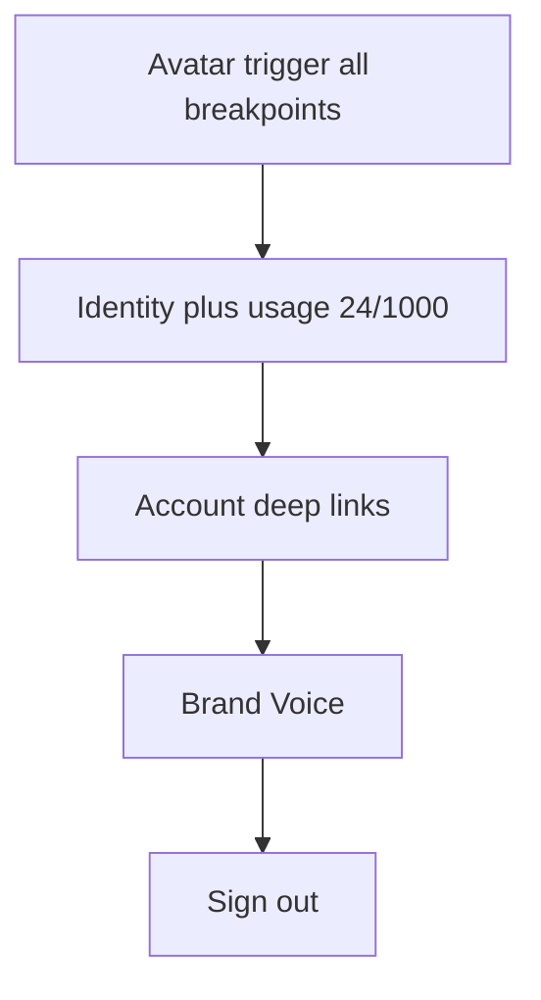

# Account menu hub (GitHub-style)

**Branch:** `feat/account-menu-hub` from current `main`.  
**Locked:** usage lives in the **menu header** (not a sticky top-bar chip); same menu on **mobile**; slim the drawer of Account/usage/sign-out duplicates.

---

## Menu map (concrete)

Widen `[components/app/account-menu.tsx](components/app/account-menu.tsx)` (~`w-64`–`w-72`). Pass` usage: UsageInfo`in addition to`user`.

**Header (non-clickable block):**

- Avatar + display name + truncated email (GitHub identity row)
- Compact usage: `{used} / {limit}` · `{planLabel}` · thin progress bar
- Link/button “Upgrade” → `/account#plans` (or whole usage row clickable to `#usage`)

**Group — Account**

| Label      | Href                  |
| ---------- | --------------------- |
| Profile    | `/account#profile`    |
| Appearance | `/account#appearance` |
| Usage      | `/account#usage`      |
| Plans      | `/account#plans`      |
| Billing    | `/account#billing`    |

**Group — Workspace**

| Label       | Href                                                                |
| ----------- | ------------------------------------------------------------------- |
| Brand Voice | `/brand-voice` (or `/account#voice` — prefer full Brand Voice page) |

**Footer**

| Label    | Action                  |
| -------- | ----------------------- |
| Sign out | existing `useSignOut()` |

Icons via `lucide-react` (User, Palette, Gauge, CreditCard, Mic, LogOut, etc.) — match density of current shell, not a second design system.

**Out of menu (no dead links):** Organizations, Copilot, status, multi-account — not product surfaces.

Danger zone (Delete account) stays on `/account#danger` only — not promoted in the menu.

---

## Shell / mobile wiring

`[dashboard-shell.tsx](app/(dashboard)`/_components/dashboard-shell.tsx):

1. Pass `usage` into `<AccountMenu user={user} usage={usage} />`
2. Remove `hidden md:inline-flex` on the trigger → **visible on mobile** in the sticky top bar
3. **Remove** the collapse-only compact top-bar usage (`vo-topbar-usage`) — usage now lives in the menu (avoids two homes)
4. Mobile drawer footer: keep nav links; **remove** duplicate `UsageIndicator`, user card, and `SignOutButton` (avatar menu owns those). Drawer becomes nav-only + close
5. Desktop sidebar footer: **remove** the full `UsageIndicator` card (menu is the home for usage). Keep slim avatar + sign-out in sidebar **or** drop sign-out there too and leave only a non-interactive identity strip — **default: keep avatar + SignOutButton in sidebar footer for muscle memory; drop only the usage card** so spend isn’t duplicated in three places

CSS: drop or leave unused `html.vo-sidebar-collapsed .vo-topbar-usage` rule in `[globals.css](app/globals.css)` (remove dead rule).

---

## Primitive polish

Extend `[components/ui/dropdown-menu.tsx](components/ui/dropdown-menu.tsx)` only if needed:

- `DropdownMenuLabel` / `DropdownMenuGroup` for header + sections (add thin wrappers if missing)

No new Radix packages — `@radix-ui/react-dropdown-menu` already installed.

---

## Acceptance / gates

- Small acceptance note optional; or fold into a one-line Wave 2 follow-up. Prefer a short `docs/acceptance` note only if we add an AC assert.
- Optional gate: `AccountMenu` + `#plans` / `#billing` deep links ≥ 1 — light touch in `run_wave2` or a tiny `run_shell` assert; **default: no new phase**, just typecheck/lint + manual smoke.

**Manual smoke:** desktop + mobile top-bar avatar → header shows usage → each link lands on correct Account section → Sign out → drawer has no duplicate usage/sign-out.

---

## Out of scope

- Sticky always-on top-bar usage chip (rejected — choice A)
- New Account page sections / billing APIs
- Theme toggle inside the menu (Appearance deep-link is enough)
- Visual baseline regen (sign-in/landing only; dashboard not in visual.spec)

---

## PR

One PR: `feat/account-menu-hub` → open for review, **do not merge** until you say so.