# Audit findings mitigation plan

Clear every item from Grok’s audit and Claude’s live infra review, in the agreed order. Deliver as **small sequential PRs** (reviewable, mergeable independently) plus a **parallel ops checklist** for dashboard-only work.

**Defaults chosen:** Hobby Vercel cannot run sub-daily crons — orphan + stuck-render settlement moves into the ffmpeg worker lifecycle (service role already present). Stripe billing-period metering ships as the last pre-revenue PR. M3/M4/L2 are included, not deferred forever, but last among code work.

```mermaid
flowchart LR
  subgraph wave1 [Wave 1 - hours]
    M1[M1 redirect]
    L1[L1 wake compare]
    OpsEU[Railway EU]
    OpsSB[Supabase advisors + MIME]
  end
  subgraph wave2 [Wave 2 - worker]
    H2[H2 stuck rendering]
    H3[H3 orphan settle in worker]
    M4[M4 lifecycle batching]
  end
  subgraph wave3 [Wave 3 - billing]
    H1[H1 reserve on bundle generate]
    M2[M2 clip insert fail-closed]
    M5[M5 bundle generate rate limit]
  end
  subgraph wave4 [Wave 4 - polish]
    M3[M3 library groups]
    L2[L2 soft limits]
    Stripe[Stripe period metering]
    Env[Env + domain checklist]
  end
  wave1 --> wave2 --> wave3 --> wave4
```

---

## Wave 1 — Security / compliance quick wins (parallel)

### PR A — `fix/auth-redirect-and-wake-secret`

**M1 open redirect** in [`lib/supabase/middleware.ts`](lib/supabase/middleware.ts):

- Replace `redirect.startsWith("/")` with a same-origin check after `new URL(destination, request.url)`, rejecting `//…` and non-matching origins; fallback `/dashboard`.
- Mirror the same helper for defensive consistency if any other `new URL(userInput, base)` redirect appears (callback path is already safe via string concat — leave it unless a shared helper is trivial).

**L1 wake secret** in [`workers/ffmpeg-renderer/src/server.ts`](workers/ffmpeg-renderer/src/server.ts):

- Replace `secret !== wakeSecret` with length-checked `timingSafeEqual` (same pattern as [`app/api/cron/sweep-pending-repurposes/route.ts`](app/api/cron/sweep-pending-repurposes/route.ts)).

Branch from clean `main`, PR into `main`, do not merge without explicit ask.

### Ops (manual, start immediately — not blocked on PR A)

| # | Action | Where |
|---|---|---|
| O1 | Move Railway service `RepurposeOne` region **sfo → EU** (e.g. `amsterdam` / closest to `eu-west-2`) | Railway dashboard — Claude’s escalated GDPR transfer |
| O2 | Enable **leaked password protection** | Supabase Auth settings |
| O3 | `REVOKE EXECUTE ON FUNCTION handle_new_user(), rls_auto_enable() FROM anon, authenticated` (keep trigger ownership intact) | SQL editor — new migration file in repo + apply manually |
| O4 | Pin `search_path` on `set_brand_voices_updated_at` | Same migration |
| O5 | Set `bundle-media` `allowed_mime_types` to accepted video/image MIMEs only | Supabase Storage |
| O6 | Spot-check Vercel env: no `OPENROUTER_*` / model slug overrides fighting code defaults | Vercel project settings |
| O7 | Note only: attach `voiceora.io` before launch (Stripe success URLs, Supabase OAuth allowlist, Capacitor) — sequencing, not a defect fix |

Migration for O3/O4 lives in PR A or a tiny follow-up `chore/supabase-advisor-hardening` so the repo matches what you apply in the SQL editor.

---

## Wave 2 — Worker self-healing (H2 + H3 + M4)

### PR B — `fix/worker-orphan-and-render-reclaim`

Extend [`workers/ffmpeg-renderer/src/lifecycle.ts`](workers/ffmpeg-renderer/src/lifecycle.ts) (already runs on boot + hourly in [`index.ts`](workers/ffmpeg-renderer/src/index.ts)):

1. **H2 — Reclaim stuck `rendering`:** update `bundle_clips` where `render_status = 'rendering'` and `updated_at` older than ~15m → `pending` if `attempt_count < 2`, else `failed` with a distinct `error_message` (e.g. `orphaned_rendering: reclaimed by worker`).
2. **H3 — Settle aged orphans here** (Hobby cannot schedule Vercel more than daily):
   - Same 10m age + messages as [`sweep-pending-repurposes/route.ts`](app/api/cron/sweep-pending-repurposes/route.ts) for `repurposes.status = pending` and `bundles.status in (pending, analyzing)`.
   - Keep the Vercel daily cron as a backup; leave `vercel.json` on Hobby-legal daily schedule (do **not** ship `*/15` or deploy will fail on Hobby).
3. **Tighten lifecycle interval** from 60m to **10m** in `index.ts` so H2/H3 meet the 10m orphan gate in practice.
4. **M4 — Batch unbounded sweeps:** add `.limit(100)` + loop/keyset on expired clips, abandoned sources, and `sweepCompletedBundleSources` video-asset scan.

Optional one-shot: document in a short comment that Vercel cron remains daily-on-Hobby by design; worker is primary.

---

## Wave 3 — Bundle generate billing correctness (H1 + M2 + M5)

### PR C — `fix/bundle-generate-quota-and-clips`

In [`app/api/bundles/generate/route.ts`](app/api/bundles/generate/route.ts):

**H1 — Reserve before AI that leads to billable completes:**

- After bundle claim/create and before `runBundleGeneration`, for each requested format call `reservePendingRepurpose` with `generationId: bundle.generation_id` (existing RPC + advisory lock in [`lib/usage.ts`](lib/usage.ts) / migration).
- On `QuotaExceededError`: mark any rows already reserved in this request `failed`, mark bundle `failed` if this request created/claimed it in a half-done way as appropriate, return 402.
- Format fan-out **updates** those reserved rows (complete/failed) instead of raw `.insert()` at ~659–672.
- On vision/`runBundleGeneration` failure: settle reserved pending rows to `failed` as well as the bundle (today only the bundle is failed).

**M2 — Clip insert fail-closed:**

- If `preparedBundleId` and `pack.clip_specs.length > 0` and insert fails (or zero rows when specs expected for verified assets): set bundle `failed`, settle reserved repurposes to `failed`, return 502 — do not set `complete`.

**M5 — Bundle generate burst limit:**

- Add `checkBundleGenerateRateLimit` in [`lib/usage.ts`](lib/usage.ts) counting this user’s `bundles` with `updated_at` in the rate window and status in `analyzing|complete|failed` (or equivalent that tracks generate attempts, not only prepare creates).
- Call it in generate beside the existing `checkRateLimit`.

---

## Wave 4 — Scale polish + pre-revenue metering

### PR D — `fix/library-group-pagination`

**M3** in [`app/(dashboard)/library/page.tsx`](app/(dashboard)/library/page.tsx): replace unbounded grouped index select with SQL that pages distinct `source_hash` groups (RPC or constrained query), then hydrate only the page slice — mirror flat-list pagination discipline.

**L2:** `.limit(50)` on brand-voice list; page account-delete storage path selects if needed (chunked deletes already exist).

### PR E — `feat/stripe-period-metering` (pre-revenue, last)

Align `getCurrentBillingPeriod` / reservation `p_start`/`p_end` with Stripe `current_period_start/end` when `stripe_subscription_id` is set; free/calendar month remains for free plan. Store period bounds on `profiles` or read from Stripe with caching — prefer writing period timestamps from the existing webhook handlers so reservation stays DB-local (no Stripe call under lock). Addresses the day-28 double-quota case Claude escalated.

---

## Verification checklist (per PR)

- Mechanical: existing `scripts/ac-check.sh` / CI green.
- M1: logged-in visit `/sign-in?redirect=//example.com` stays on-origin.
- H2: set a clip to `rendering` with old `updated_at`; within one lifecycle tick it returns to `pending` or `failed`.
- H3: aged `pending` repurpose stops counting toward `reserve_pending_repurpose` after worker lifecycle.
- H1: near-cap concurrent Studio + bundle generate cannot create an extra distinct `generation_id`.
- M2: forced clip insert failure → 502 and bundle not `complete`.
- Ops: Railway region shows EU; storage MIME allowlist set; advisor items cleared.

---

## Explicitly out of this plan’s code scope

- Studio fence / UI redesign contract (documented deliberate).
- Re-litigating `provider.only` / billing unit asymmetry.
- Attaching `voiceora.io` implementation details beyond the ops note (launch program).
- OpenRouter live `provider.only` probe (one-time staging check — manual ops note in O6).
