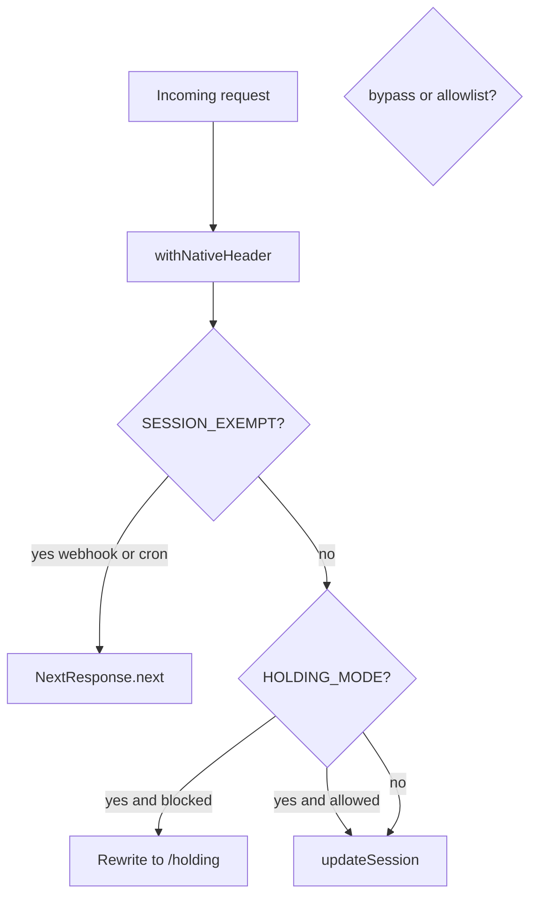

# B2 — Holding allowlist + session exemption

**Brief:** `BRIEF-B2-holding-allowlist.md`  
**Branch:** `fix/holding-allowlist-webhook-legal`  
**Baseline:** `main` after B1 ([PR #121](https://github.com/philipwpillar/RepurposeOne/pull/121)) is merged  
**Loop:** implement → push → open PR → stop (no merge)



## Prerequisite

Confirm B1 is on `main` and CI is green. Then:

```bash
git checkout main && git pull origin main
git checkout -b fix/holding-allowlist-webhook-legal
```

## Code changes (three files only)

### 1. [`middleware.ts`](middleware.ts)

- Add `SESSION_EXEMPT_PREFIXES = ["/api/stripe/webhook", "/api/cron"]` with the brief’s comment (narrow webhook path; never `/api/stripe`).
- At the top of `middleware`, after `withNativeHeader`, early-return:

```ts
if (SESSION_EXEMPT_PREFIXES.some((p) => pathname.startsWith(p))) {
  return NextResponse.next({ request: { headers: requestHeaders } });
}
```

- Extend `HOLDING_ALLOWLIST` with `/privacy` and `/terms`. Keep `/api/cron` as belt-and-braces. **Do not** add `/api/stripe/webhook` to the allowlist.
- Leave bypass-cookie-on-200 logic and `matcher` untouched.

### 2. [`lib/supabase/middleware.ts`](lib/supabase/middleware.ts)

Add `/bundles` and `/onboarding` to `PROTECTED_PREFIXES`. Defence in depth only — PR description must not call this an auth vulnerability fix.

### 3. [`scripts/ac-check.sh`](scripts/ac-check.sh)

In `run_floor()`, add five asserts (follow existing `n`/`assert` helpers; never `\"` in rg patterns):

| Label | Check |
|---|---|
| webhook exempt present | `n '/api/stripe/webhook' middleware.ts` `ge 1` |
| privacy allowlisted | `n '/privacy' middleware.ts` `ge 1` |
| terms allowlisted | `n '/terms' middleware.ts` `ge 1` |
| no over-broad stripe prefix | `n -F '"/api/stripe"' middleware.ts` **`eq 0`** |
| bundles protected | `n '/bundles' lib/supabase/middleware.ts` `ge 1` |

The `eq 0` fixed-string gate is the load-bearing anti-regression for checkout/portal exposure.

## Out of scope

- Unset `HOLDING_MODE`
- Allowlist checkout/portal
- Bypass cookie / matcher / unrelated refactors

## Local gates before push

```bash
bash scripts/ac-check.sh floor   # EXIT 0
npm run typecheck
npm run build
```

## PR + verification

- Open PR into `main`; **do not merge**.
- Paste Mode B webhook `curl -i` raw output in the PR body (signature 400, not holding HTML).
- Document Mode A (holding off) vs Mode B (Preview with `HOLDING_MODE=true` temporarily) per brief §5 — default Preview alone is a false pass.
- After Phil merges + Production deploy: he re-probes `www.voiceora.io` webhook; only then start A3 replay.

## After this PR (Phil, not Cursor)

A1 webhook URL → `www.voiceora.io` → A2 `invoice.paid` → A3 replay → A4 reconcile.
