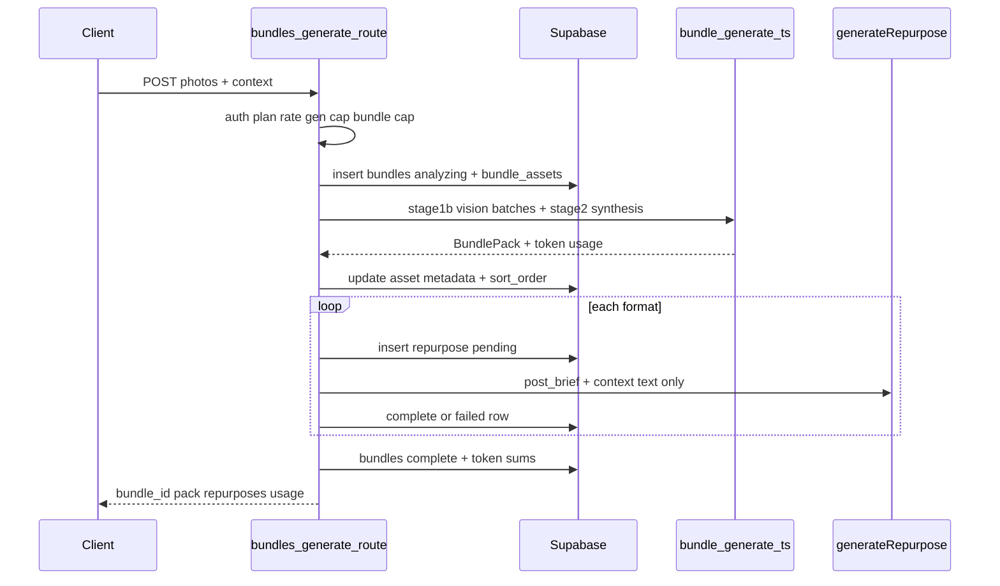

# Brief 1b: Bundle generate route (photo pack)

## Goal

Ship the first bundle application code: **`POST /api/bundles/generate`** — Pro Plus users send 1–8 photos + context; API returns captions, posting order, and up to four platform posts as one bundle billed as **one** `generation_id`. Photos only (no video, clips, storage, worker, or `/bundles` UI).

**Baseline:** `main` @ `83e5777` (1a merged). **Branch:** `feat/brief-1b-bundle-generate`. **Deploy prerequisite:** [`supabase/migrations/20260717140000_moment_bundle_schema.sql`](supabase/migrations/20260717140000_moment_bundle_schema.sql) applied to prod before deploy.

## Architecture

## File plan (7 touched areas, ~5 new files)

| Action | Path |
|--------|------|
| Additive | [`types/index.ts`](types/index.ts) |
| New | [`lib/ai/bundle-generate.ts`](lib/ai/bundle-generate.ts) |
| Extend | [`lib/ai/prompts.ts`](lib/ai/prompts.ts) — `buildBundlePhotoAnalysisPrompt`, `buildBundlePackSynthesisPrompt` |
| Additive only | [`lib/ai/generate.ts`](lib/ai/generate.ts) — **new** `completeOpenRouterJson` export + helpers; `generateRepurpose` / `generateRepurposeFromImage` remain byte-identical (no refactor through helper) |
| New | [`lib/repurpose/brand-voice.ts`](lib/repurpose/brand-voice.ts) — move `resolveBrandVoice` from generate route |
| Minimal import swap | [`app/api/generate/route.ts`](app/api/generate/route.ts) — import `resolveBrandVoice` only |
| New | [`app/api/bundles/generate/route.ts`](app/api/bundles/generate/route.ts) |
| New | [`lib/repurpose/bundle-generate-client.ts`](lib/repurpose/bundle-generate-client.ts) |

**Do not touch:** [`app/(dashboard)/studio/_components/RepurposeWorkspace.tsx`](app/(dashboard)/studio/_components/RepurposeWorkspace.tsx), `lib/usage.ts` internals, Stripe, `count_monthly_generations`, storage, `bundle_clips` writes.

## 1. Types ([`types/index.ts`](types/index.ts))

Add bundle contracts (brief §1; spike amends plan §4 — **no `clip_specs`**, **photo_index** not `asset_id`):

- **`BundleGenerateRequestSchema`**
  - `title`: optional string max 200
  - `context`: string min 10 max 2000 (aligns with [`PHOTO_CONTEXT_*`](lib/image/constants.ts))
  - `photos`: array min 1 max 8 of `{ data: base64 string min 1, filename?: string }`; per-photo `data.length` ≤ `AI_CONFIG.maxImageBase64Chars` ([`lib/config.ts`](lib/config.ts))
  - `formats`: optional `TargetFormat[]`, default all four in route/parser
- **`BundlePhotoAnalysisSchema`** (stage-1b output): `{ photos: [{ index, description, caption_angle, quality_note? }] }`
- **`BundlePackSchema`** (stage-2 photo subset): `{ photo_captions: [{ photo_index, caption ≤2200, alt_text ≤500 }], posting_order: number[], post_brief ≤2000 }`
- **API types:** success body `{ bundle_id, pack, repurposes: [{ id, target_format, status, output }], usage }`; extend error `code` union with **`bundle_limit_reached`** (bundle client + route; keep existing `GenerateErrorResponse` codes unchanged for studio)

**Brand voice:** not in request schema — resolve **default** `brand_voices` row (`is_default = true`) for user; fallback inline voice same as [`photo-generate-client.ts`](lib/repurpose/photo-generate-client.ts) L54–57.

**MIME for vision:** infer from `filename` (`.png`/`.webp`/else `image/jpeg`); strip data-URL prefix if client sends it.

## 2. Shared AI plumbing ([`lib/ai/generate.ts`](lib/ai/generate.ts)) — **amendment**

`completeOpenRouterJson` is a **new export only**, used by bundle orchestration (findings **#4/#5/#7**):

- `completeOpenRouterJson<T>({ model, messages, schema: ZodType<T> })` → `{ data: T, tokens… }`
- Always: `reasoning: { enabled: false }`, `response_format: { type: "json_object" }`, `provider.only` unchanged
- **Shape-validated retry:** `parseJsonResponse` → `schema.safeParse`; on failure **one** retry after **2s** `setTimeout`; then throw
- Duplicating ~15 lines of completion-param construction vs the existing generators is the **accepted cost**

**Hard rule:** `generateRepurpose` and `generateRepurposeFromImage` remain **byte-identical** — do **not** refactor them through the helper, do **not** wrap them in retry. Acceptance: `git diff main -- lib/ai/generate.ts` shows **only added lines** (new helper + export); **zero** modified/deleted lines inside the two existing functions.

## 3. Orchestration ([`lib/ai/bundle-generate.ts`](lib/ai/bundle-generate.ts))

**`runPhotoBundleGeneration(input)`** returns `{ pack: BundlePack, tokenTotals, modelId }`.

**Stage 1b (vision)** — finding **#3**: batch photos **≤4 images per API call**; for 5–8 photos, two calls with **global index offset** on merged `photos[]`.

- Model: `AI_CONFIG.visionModel` (`AI_MODEL_VISION`)
- Validate each batch with `BundlePhotoAnalysisSchema`; merge arrays
- **Finding #6:** only pass Zod-validated stage-1b JSON into stage 2

**Stage 2 (synthesis)** — text-only:

- Model: `AI_MODEL_STRONG` via `getModelForFormat` tier or direct `AI_CONFIG` strong model
- Input: merged stage-1b JSON + user `context` + `buildBrandVoiceBlock(resolvedVoice)`
- Output validated with `BundlePackSchema`
- Stage-2 exemplars: **omit** — approved deviation: exemplars apply only at per-format `generateRepurpose` calls (S2 plumbing is format-scoped); stage 2 stays clean pack synthesis + brand voice

**Token accounting:** sum `total/prompt/completion` across stage 1b batches + stage 2 + (route adds format calls separately)

## 4. Route ([`app/api/bundles/generate/route.ts`](app/api/bundles/generate/route.ts))

Mirror [`app/api/generate/route.ts`](app/api/generate/route.ts) gate order:

1. Auth (`createClient`); parse `BundleGenerateRequestSchema` → 400
2. `getUserPlan` → `planAllowsBundles` else **403** `{ code: "plan_required" }` + Pro Plus upgrade copy (`getUpgradeMessage`)
3. `checkRateLimit(supabase, user.id, plan)` → 429
4. `checkUsageLimit` → **402** `limit_exceeded` + usage (same shape as studio)
5. **N2:** `supabase.rpc("count_monthly_bundles", { p_user_id, p_start, p_end })` vs `BUNDLE_MONTHLY_LIMIT` (30) → **402** `{ code: "bundle_limit_reached" }` (inline in route; mirror `getMonthlyUsage` date formatting from [`lib/usage.ts`](lib/usage.ts))
6. Resolve **default** brand voice only (`resolveDefaultBrandVoice`) — approved deviation: no voice picker in request (v1); 1c may add selection later
7. Insert `bundles` (`status: 'analyzing'`, `title`, `context`, capture `id` + `generation_id` from insert/select)
8. Insert `bundle_assets` per photo: `kind: 'photo'`, `storage_path: null`, `sort_order` = upload index, `metadata: { filename }`
9. `runPhotoBundleGeneration` — on throw: update bundle `failed` + `error_message`, return **502** (no complete repurposes → not billed)
10. Persist pack: update each asset `metadata` with `{ caption, alt_text }` (merge filename); reorder `sort_order` from `posting_order` (photo indexes → 0..n-1 positions)
11. For each requested `format`:
    - `fetchVoiceExemplarsText(supabase, user.id, format)` (never fail generation)
    - Insert `repurposes` `pending`: `input_type: 'paste'`, `input_content` = `post_brief` + `\n\n` + `context`, `bundle_id`, shared `generation_id`, `brand_voice_id` if default voice had id
    - `generateRepurpose({ inputContent, brandVoice, targetFormat, exemplarsText })`
    - Update row `complete` or `failed` (partial OK; one failed format does not fail bundle)
12. Update `bundles`: `status: 'complete'`, sum tokens across **all** AI calls (orchestration + formats), `model` = vision model id, `updated_at: now()`
13. Response JSON per brief; `usage` from fresh `checkUsageLimit`

**502 copy:** user-facing message similar to `toUserFacingGenerationError` in generate route.

## 5. Client ([`lib/repurpose/bundle-generate-client.ts`](lib/repurpose/bundle-generate-client.ts))

Sibling of [`photo-generate-client.ts`](lib/repurpose/photo-generate-client.ts):

- `BundleGenerateApiError` with optional `usage` + `code`
- `callBundleGenerateApi({ photos, context, title?, formats? })` → `POST /api/bundles/generate`
- Parse 402/403 like photo client (`limit_exceeded`, `bundle_limit_reached`, `plan_required`)

No UI imports yet (Brief 1c).

## 6. Brand voice extraction ([`lib/repurpose/brand-voice.ts`](lib/repurpose/brand-voice.ts))

Move `resolveBrandVoice` from generate route **unchanged** (byte-equivalent). Add **`resolveDefaultBrandVoice(supabase, userId)`** for bundle route: fetch `is_default` voice or fallback inline profile.

[`app/api/generate/route.ts`](app/api/generate/route.ts): delete local function; import from `lib/repurpose/brand-voice.ts` only.

## Spike findings (PR must cite #3–#7)

| # | Implementation |
|---|----------------|
| 3 | Vision batches ≤4 images; merge with index offset |
| 4 | `reasoning: { enabled: false }` on every bundle AI call |
| 5 | `response_format: json_object` + Zod safeParse retry (1×, 2s backoff) |
| 6 | Stage 2 only after validated stage-1b; route marks bundle `failed` if orchestration throws |
| 7 | New `completeOpenRouterJson` export in `lib/ai/generate.ts` (add-only; studio generators untouched) |

(Spike report file not in repo; brief is source of truth.)

## Accepted deviations (Phil-approved)

1. **Exemplars at per-format calls, not stage 2** — exemplars are per-format signals; S2 already injects them there; stage 2 stays pack synthesis.
2. **Default brand voice only in v1** — no `brand_voice_id` / picker on the request; remember when drafting Brief 1c.

## Verification

- `npx tsc --noEmit` && `npx next build`
- `git diff main -- app/(dashboard)/studio/_components/RepurposeWorkspace.tsx` empty
- `git diff main -- lib/ai/generate.ts` — **only added lines**; zero modified/deleted lines in `generateRepurpose` / `generateRepurposeFromImage`
- Manual QA (dev `pro_plus` profile + curl/script):
  - free/creator/pro → 403; pro_plus → 3-photo and 8-photo success (two-batch path)
  - `count_monthly_generations` +1 per bundle only when ≥1 format completes
  - 31st bundle in month → 402 `bundle_limit_reached` (seed `bundles` rows)
  - Break stage 2 (bad model env) → bundle `failed`, no complete repurposes
  - One format fails → bundle `complete`, other rows intact

## Git / PR

1. Branch `feat/brief-1b-bundle-generate` from `main`
2. Commit with brief-focused message
3. Push; PR title: **Brief 1b: bundle generate route (photo pack)**
4. PR body: 1a migration prerequisite; spike #3–#7; manual QA checklist
5. **Stop** — no merge, no 1c
