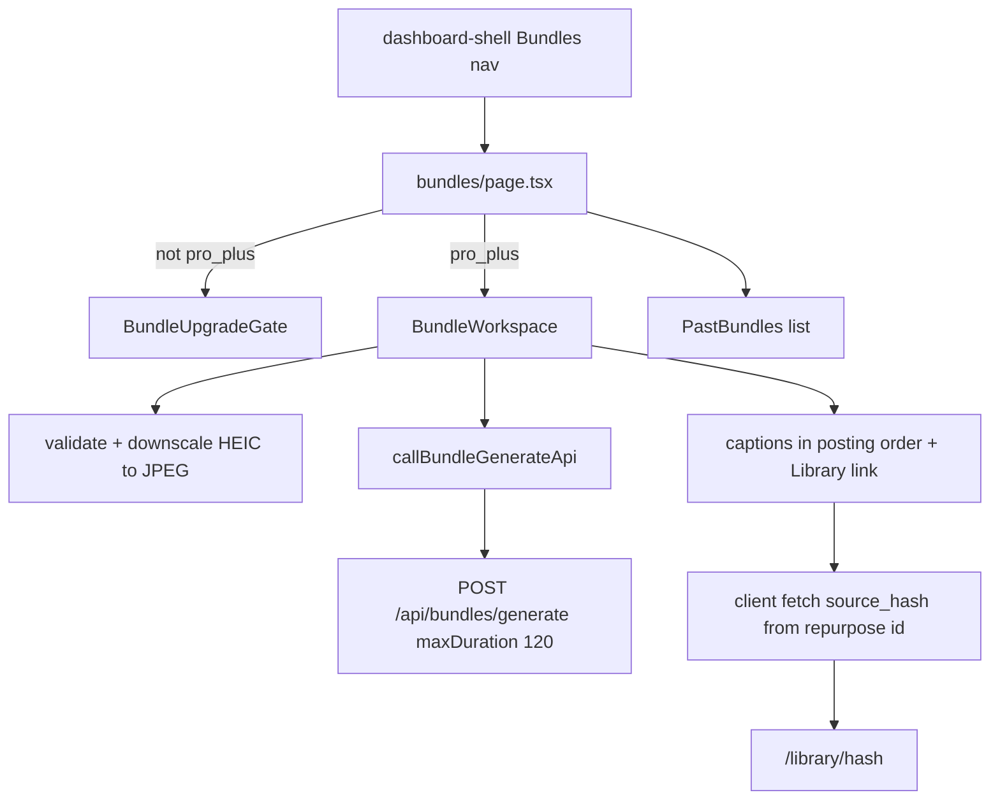

# Brief 1c: `/bundles` workspace (photo packs)

## Goal

Give Moment Bundles a UI: Pro Plus users on **`/bundles`** upload 1–8 photos, add context, generate, then see captions in posting order with copy actions and a Library link to the four platform posts. Photo-only. No video, clips, storage, or render UI.

**Baseline:** `main` @ `0ecf5e6`. **Branch:** `feat/brief-1c-bundles-workspace`.

## Architecture



## File plan

| Action | Path |
|--------|------|
| New | [`app/(dashboard)/bundles/page.tsx`](app/(dashboard)/bundles/page.tsx) |
| New | [`app/(dashboard)/bundles/_components/BundleUpgradeGate.tsx`](app/(dashboard)/bundles/_components/BundleUpgradeGate.tsx) |
| New | [`app/(dashboard)/bundles/_components/BundleWorkspace.tsx`](app/(dashboard)/bundles/_components/BundleWorkspace.tsx) |
| New | Sibling multi-photo pieces under `bundles/_components/` (e.g. `BundlePhotoPicker.tsx`, `BundlePhotoThumb.tsx`, `PastBundlesList.tsx`) — **do not change studio** [`PhotoDropZone.tsx`](app/(dashboard)/studio/_components/PhotoDropZone.tsx) / [`PhotoPreviewCard.tsx`](app/(dashboard)/studio/_components/PhotoPreviewCard.tsx) behavior |
| Edit | [`app/(dashboard)/_components/dashboard-shell.tsx`](app/(dashboard)/_components/dashboard-shell.tsx) — one nav item |
| Edit | [`lib/ai/prompts.ts`](lib/ai/prompts.ts) — `buildBundlePackSynthesisPrompt` system text only |
| Edit | [`app/api/bundles/generate/route.ts`](app/api/bundles/generate/route.ts) — **one line:** `export const maxDuration = 120;` |
| Additive | [`lib/image/constants.ts`](lib/image/constants.ts) + [`lib/image/downscale.ts`](lib/image/downscale.ts) — HEIC/HEIF support for the brief’s iPhone path |

**Do not touch:** [`RepurposeWorkspace.tsx`](app/(dashboard)/studio/_components/RepurposeWorkspace.tsx), [`lib/ai/bundle-generate.ts`](lib/ai/bundle-generate.ts), [`lib/ai/generate.ts`](lib/ai/generate.ts), any other API surface.

## 1. HEIC path (additive image helpers)

Today [`validateImageFile`](lib/image/downscale.ts) rejects anything outside jpeg/png/webp, so iPhone HEIC fails the brief’s QA.

- Add `image/heic` / `image/heif` as **input-only** accepted types for validation (and `BUNDLE_PHOTO_ACCEPT_ATTRIBUTE` used only by the bundles picker).
- Keep [`PHOTO_ACCEPT_ATTRIBUTE`](lib/image/constants.ts) / studio dropzone as jpeg/png/webp so studio picker UX is unchanged.
- In `downscaleImage`: HEIC → encode as `image/jpeg` via native `Image()`/canvas only (Safari / iOS). **Do not add a WASM/decode library.**
- **Graceful failure:** when HEIC decode fails (desktop Chrome/Firefox), throw `HEIC_DECODE_ERROR` and show per-file: *"This photo format couldn't be read by your browser — export it as JPG and try again"* — user continues with remaining photos.
- **QA:** HEIC acceptance test runs in Safari or iOS shell; in desktop Chrome the graceful failure is the pass condition.
- Size cap still `PHOTO_MAX_FILE_BYTES` (10 MB).

## 2. Page + upgrade gate

[`app/(dashboard)/bundles/page.tsx`](app/(dashboard)/bundles/page.tsx) (server), same auth pattern as [`studio/page.tsx`](app/(dashboard)/studio/page.tsx):

1. `createClient` + `getUser`; `checkUsageLimit` / `getUserPlan`.
2. If `!planAllowsBundles(plan)` → render **`BundleUpgradeGate`** only (full-page pitch, not a null-returning banner).
3. Else render **`BundleWorkspace`** + **Past bundles**.

**Past bundles query** (owner, newest first, limit 20):

- `bundles`: `id, title, context, status, created_at, generation_id`
- Nested or follow-up: `bundle_assets` ordered by `sort_order` (`metadata` for caption preview)
- One linked complete `repurposes.source_hash` where `bundle_id` matches (for `/library/[hash]`). Two-query is fine if PostgREST nesting is awkward.

**`BundleUpgradeGate`:** mirror amber/lock structure of [`PhotoUpgradeGate.tsx`](app/(dashboard)/studio/_components/PhotoUpgradeGate.tsx) but as the page body: Moment Bundles, **30/mo** (`BUNDLE_MONTHLY_LIMIT`), rendered clips “coming soon”, CTA `/billing`. Gate with `planAllowsBundles`, never raw plan string compares.

## 3. `BundleWorkspace` (client)

Reuse [`callBundleGenerateApi`](lib/repurpose/bundle-generate-client.ts), [`CopyActionButton`](components/repurpose/copy-action-button.tsx) + clipboard hook, [`PHOTO_CONTEXT_*`](lib/image/constants.ts), aurora utilities from [`app/globals.css`](app/globals.css) (`.aurora` / `.aurora-text`).

**Input**

- Multi-file picker (`accept` includes heic/heif + jpeg/png/webp); plain `<input type="file" multiple>` for Capacitor iOS — no new plugins.
- Cap **8** client-side (reject 9th with clear copy); each file → `validateImageFile` + `downscaleImage`; thumbnail grid with remove; count + `formatByteSize` totals.
- Context textarea 10–2000; optional title ≤200.
- Generate: always all four formats (omit `formats` on the client call).

**Progress**

- While awaiting the single long `fetch`: rotate cosmetic stages on a timer (“Reading your photos…” → “Writing your pack…”); disable inputs.

**Errors** (`BundleGenerateApiError`)

- 403 `plan_required` → upgrade copy + `/billing`
- 402 `limit_exceeded` → usage message
- 402 `bundle_limit_reached` → message + monthly count framing
- 502 / network → retry framing that the failed attempt is **not billed**

**Result**

- Photos in `pack.posting_order`, showing **1-indexed** labels (“Photo 1”…); caption + alt under each; copy buttons per caption (and alt if useful).
- Keep local `previewUrl`s mapped by upload index for display after reorder.
- Library CTA: “View & edit your 4 posts in the Library →”. Resolve hash **client-side** after success: `supabase.from('repurposes').select('source_hash').eq('id', firstCompleteRepurposeId).single()` — keeps the generate API response unchanged (brief forbids API edits beyond `maxDuration`).

**Past list**

- Simple list under the workspace: title/context snippet, status, date, link to Library when `source_hash` present; optional caption count from assets.

## 4. Nav

In [`dashboard-shell.tsx`](app/(dashboard)/_components/dashboard-shell.tsx) `NAV_ITEMS`, after Studio:

```ts
{ href: "/bundles", label: "Bundles", icon: Layers }, // or Package
```

Visible to **all** plans (upgrade gate is the funnel). No other shell changes.

## 5. Prompt tuning (QA findings)

In `buildBundlePackSynthesisPrompt` **system** rules only (two sentences of intent):

- `post_brief` written **as the creator, first person**, facts and feelings — not analytical/consultant voice; **never** meta-language about “photos”, “stages”, or “documentation”.
- User-visible photo references are **1-indexed** (schema indexes stay 0-based).

No schema / orchestration changes.

## 6. Route one-liner

At top of [`app/api/bundles/generate/route.ts`](app/api/bundles/generate/route.ts):

```ts
export const maxDuration = 120;
```

Nothing else in that file.

## Verification

- `npx tsc --noEmit` && `npx next build`
- Fence: `RepurposeWorkspace.tsx` and `lib/ai/generate.ts` byte-identical vs `main`
- Manual QA per brief: free → nav + gate; pro_plus 3- and 8-photo E2E; 9th rejected; HEIC converts; captions + copy; Library link; `bundle_limit_reached`; failed run “not billed”; iOS Photos picker smoke

## Git / PR

1. Branch `feat/brief-1c-bundles-workspace` from `main`
2. Commit; push; PR title: **Brief 1c: /bundles workspace (photo packs)**
3. **Stop** — no merge, no Phase 2
