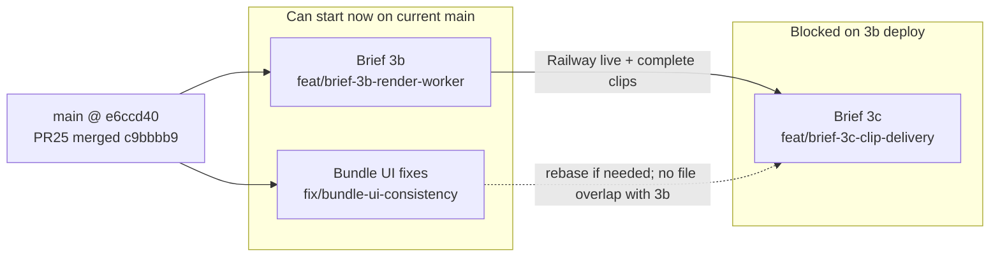

# Unified plan: Brief 3b + 3c + Bundle UI fixes

## How the three briefs relate




| Brief           | Branch                        | Baseline                    | Touches app?                                      | Depends on             |
| --------------- | ----------------------------- | --------------------------- | ------------------------------------------------- | ---------------------- |
| **UI fixes**    | `fix/bundle-ui-consistency`   | current `main` (3a merged)  | Yes — 4 files                                     | Nothing                |
| **3b Worker**   | `feat/brief-3b-render-worker` | current `main` (PR #25 merged @ `c9bbbb9`) | **No** — `workers/ffmpeg-renderer/` only | Nothing                |
| **3c Delivery** | `feat/brief-3c-clip-delivery` | `main` after 3b merges      | Yes — API + client + `BundleWorkspace` clip block | 3b deployed on Railway |


**Settled cross-brief decisions (do not re-litigate):**

- `bundles.status` stays `complete` after text pack (3a) — per-clip `render_status` is the render progress source of truth
- `NEXT_PUBLIC_VIDEO_BUNDLES_DEV` gating unchanged in all three briefs
- `[RepurposeWorkspace.tsx](app/(dashboard)`/studio/_components/RepurposeWorkspace.tsx) and `[lib/ai/generate.ts](lib/ai/generate.ts)` stay byte-identical
- Clip block L630–696 in `[BundleWorkspace.tsx](app/(dashboard)`/bundles/_components/BundleWorkspace.tsx): **UI fixes skips it**; **3c replaces it wholesale**

---

## Shared context (all briefs assume this schema)

From `[supabase/migrations/20260717140000_moment_bundle_schema.sql](supabase/migrations/20260717140000_moment_bundle_schema.sql)`:

- `**bundle_clips**`: `render_status` ∈ `pending | rendering | complete | failed`; `output_storage_path`, `error_message`, `attempt_count`, `asset_id`, `start_s`, `end_s`, `overlay_text`
- `**bundle_assets**`: `kind`, `storage_path`, `sort_order`, `metadata.upload_verified` (written in `[generate/route.ts` L573–601](app/api/bundles/generate/route.ts))
- **Storage paths**: source `{user_id}/{bundle_id}/{asset_id}.{ext}` (`[lib/video/storage-path.ts](lib/video/storage-path.ts)`); rendered `{user_id}/{bundle_id}/clips/{clip_id}.mp4`
- **Overlay sanitization at generate time**: `[stripOverlayEmoji](lib/ai/bundle-generate.ts)` — worker must mirror locally (no cross-runtime import)

---

## Brief A — Bundle UI consistency fixes (start first)

**Goal:** Fix marketing-style page title and photo-only past-bundle summaries. Pure UI/copy — no API, schema, or worker.

### Files (4 only)


| File                                                                                       | Change                                                                                                                                                           |
| ------------------------------------------------------------------------------------------ | ---------------------------------------------------------------------------------------------------------------------------------------------------------------- |
| `[BundleWorkspace.tsx](app/(dashboard)`/bundles/_components/BundleWorkspace.tsx) L392–398  | Replace eyebrow + `font-display`/`aurora-text` with Studio-style `<h1 className="text-2xl font-semibold tracking-tight">` (keep "Moment pack"/"Photo pack" text) |
| `[BundleUpgradeGate.tsx](app/(dashboard)`/bundles/_components/BundleUpgradeGate.tsx) L8–11 | Same header treatment; text stays "Moment Bundles"                                                                                                               |
| `[bundles/page.tsx](app/(dashboard)`/bundles/page.tsx) L32–63                              | Select `kind` on `bundle_assets`; build `photoCount`/`videoCount` per bundle instead of flat `assetCount`                                                        |
| `[PastBundlesList.tsx](app/(dashboard)`/bundles/_components/PastBundlesList.tsx)           | Replace `assetCount: number` with `photoCount` + `videoCount`; summary: "N photo(s)" / "N video(s)" / "N photo(s), M video(s)" with independent pluralization    |


**Reference header** (match exactly): `[RepurposeWorkspace.tsx](app/(dashboard)`/studio/_components/RepurposeWorkspace.tsx) L577 — `text-2xl font-semibold tracking-tight`, no gradient, no eyebrow.

**Differs from other briefs:** Only brief with zero worker/API work; only brief touching `PastBundlesList` and `bundles/page.tsx`; explicitly does **not** touch clip preview block.

### Verify

- `npx tsc --noEmit` + `npx next build`
- Side-by-side screenshot: Bundles title matches Studio
- Seed/flag QA: photo-only → "N photos"; video-only → "N videos"; mixed → "N photos, M videos"
- PR title: **"Fix: bundle UI consistency (title font, kind-aware copy)"** — open, do not merge

---

## Brief B — ffmpeg render worker (3b)

**Goal:** Always-on Railway worker that claims `pending` clips, renders via ffmpeg, uploads MP4, runs lifecycle sweeps. **Zero Next.js app changes.**

**Baseline:** current `main` — PR #25 (`feat/brief-3a-video-upload`, `c9bbbb9`) already merged. Branch now, in parallel with UI fixes.

### New package: `workers/ffmpeg-renderer/`

Self-contained — own `package.json`, `tsconfig.json`, `.env.example`, `README.md`. **No repo-root `package.json` changes.**

```
workers/ffmpeg-renderer/
├── Dockerfile
├── package.json / tsconfig.json / .env.example / README.md
├── fonts/
│   ├── SpaceGrotesk-SemiBold.ttf   ← download OFL from Google Fonts; not in repo today
│   └── OFL.txt
└── src/
    ├── index.ts       poll loop + SIGTERM graceful shutdown
    ├── render.ts      Spike 3 ffmpeg pipeline
    ├── lifecycle.ts   hourly retention/source cleanup
    ├── server.ts      GET /health, POST /wake
    ├── supabase.ts    standalone service-role client (mirror `[lib/supabase/admin.ts](lib/supabase/admin.ts)`)
    ├── text.ts        stripOverlayEmoji mirror + word-wrap pre-processor
    └── paths.ts       buildOutputPath(userId, bundleId, clipId)
```

### 1. Dockerfile (finding #9 gate)

- Base: `node:20-bookworm-slim` + `apt-get install -y ffmpeg`
- `**RUN ffmpeg -filters | grep drawtext**` — build fails if drawtext missing (non-negotiable)
- Copy font + OFL license into image
- `npm ci && npm run build`; `CMD ["node", "dist/index.js"]`

### 2. Poll loop (`[src/index.ts](workers/ffmpeg-renderer/src/index.ts)`)

Every `POLL_INTERVAL_MS` (default 5000):

1. **Claim one clip** (optimistic, single instance):
  ```sql
   UPDATE bundle_clips
   SET render_status='rendering', attempt_count=attempt_count+1, updated_at=now()
   WHERE id = (
     SELECT id FROM bundle_clips
     WHERE render_status='pending' AND attempt_count < 2
     ORDER BY updated_at ASC LIMIT 1
   ) AND render_status='pending'
   RETURNING *;
  ```
   Proceed only if a row was returned.
2. **Pre-flight:** load clip's `bundle_assets` row; require `metadata.upload_verified === true` — else mark `failed` with clear message (never download).
3. **Render** via `render.ts` with `RENDER_TIMEOUT_MS` (default 300000) — kill ffmpeg on timeout, treat as failure.
4. **Failure handling:** on error, if `attempt_count >= 2` → `failed` + `error_message`; else reset to `pending` for retry next cycle.
5. **SIGTERM:** finish current render, then exit.

**Stuck `rendering` rows:** if worker is killed mid-render, row may stay `rendering` (no sweeper in v1). Document manual SQL reset in README.

### 3. Renderer (`[src/render.ts](workers/ffmpeg-renderer/src/render.ts)`)

Pipeline (Spike 3 validated):

1. Download source from `bundle-media` to temp dir; `finally` cleanup always
2. **Duration backstop:** `ffprobe` real duration; clamp `end_s`; if clamped window < 5s → fail with message
3. **Overlay prep (#10):** re-sanitize (mirror `stripOverlayEmoji`), pre-wrap at word boundaries → ≤2 lines × ≤32 chars → temp textfile for drawtext
4. **Filter chain:** `scale=1080:1920:force_original_aspect_ratio=increase,crop=1080:1920` then drawtext:
  - `fontfile=<SpaceGrotesk>` `:textfile=<tmp>` `:fontsize=80:fontcolor=white:line_spacing=8:box=1:boxcolor=0x0A0F2E@0.65:boxborderw=18:x=(w-text_w)/2:y=h*0.72`
  - **y=0.72** (not spike's 0.76)
5. Trim: `-ss <start> -t <len>` before `-i`
6. Encode: `libx264 -preset medium -crf 20 -pix_fmt yuv420p -r 30`, `aac 128k`, `+faststart`
7. Upload to `{user_id}/{bundle_id}/clips/{clip_id}.mp4` (upsert, `video/mp4`)
8. Update row: `render_status='complete'`, `output_storage_path`, `updated_at`

Skip if already `complete` with `output_storage_path` set (idempotent).

### 4. Lifecycle sweep (`[src/lifecycle.ts](workers/ffmpeg-renderer/src/lifecycle.ts)`, hourly)

- **Source cleanup:** for each `video` asset whose clips are ALL terminal (`complete`/`failed`) → delete source object; keep DB row; set `metadata.source_deleted = true`
- **Grace (24h):** bundles in `pending`/`failed` older than `SOURCE_GRACE_HOURS` with video assets → delete source objects
- **D5 retention (30 days):** `complete` clips with `updated_at` > 30 days → delete rendered object, set `output_storage_path = null` (3c treats this as expired)
- Log every deletion

### 5. Health + wake (`[src/server.ts](workers/ffmpeg-renderer/src/server.ts)`)

- `GET /health` → 200 JSON `{ uptime, lastPoll, clipsRendered }`
- `POST /wake` with header `x-wake-secret: $WORKER_WAKE_SECRET` → immediate poll; 401/405 otherwise

### 6. Env (`[.env.example](workers/ffmpeg-renderer/.env.example)`)

`SUPABASE_URL`, `SUPABASE_SERVICE_ROLE_KEY`, `WORKER_WAKE_SECRET`, `POLL_INTERVAL_MS=5000`, `RENDER_TIMEOUT_MS=300000`, `SOURCE_GRACE_HOURS=24`

**Differs from other briefs:** Only brief with Docker/ffmpeg; only brief using service role outside Next.js; **no app files touched**; blocks 3c QA; does not touch `BundleWorkspace` at all.

### Verify

- `docker build` succeeds (drawtext grep gate passes)
- Worker `npm run build`; repo-root `npx tsc --noEmit` + `npx next build` unchanged
- Local E2E: `docker run` with prod env against real `pending` clip → `complete` + playable MP4, caption at 72% height
- Kill-test: mid-render stop → retry/fail behavior; document stuck-`rendering` reset
- PR title: **"Brief 3b: ffmpeg render worker (Railway)"** — open, do not merge

**Phil ops (post-merge, not in PR):** Railway → root dir `workers/ffmpeg-renderer` → set 6 env vars → deploy → check `/health`.

---

## Brief C — Clip delivery UI (3c)

**Goal:** Poll per-bundle clip status; show inline `<video>` preview + download for completed clips; spinner/error states for in-flight/failed.

**Blocked until:** 3b merged **and deployed** — QA requires a live worker producing `render_status: 'complete'` rows.

### 1. New API route: `[app/api/bundles/[id]/route.ts](app/api/bundles/[id]/route.ts)` (GET)

Follow ownership pattern from `[app/api/repurposes/[id]/feedback/route.ts](app/api/repurposes/[id]/feedback/route.ts)`:

- Auth via `createClient()` → 401 if no user
- Fetch bundle `.eq("id", id).eq("user_id", user.id).single()` → 404 if missing
- Load `bundle_clips` for bundle + video-kind `bundle_assets` ordered by `sort_order`
- `**video_index` derivation** (no migration): among video assets sorted by `sort_order`, find index of clip's `asset_id`. Document inline in route.
- For each clip with `render_status === 'complete'` and non-null `output_storage_path`: issue signed download URL via admin client:
  ```ts
  admin.storage.from("bundle-media").createSignedUrl(path, 600) // ~10 min TTL
  ```
  Mirror prepare's admin-client pattern ([`prepare/route.ts` L251–253](app/api/bundles/prepare/route.ts)).
- If `complete` but `output_storage_path` is null → expired (30-day lifecycle); omit `download_url`
- Response shape (add Zod schema in `[types/index.ts](types/index.ts)`):
  ```ts
  { bundle: { id, status }, clips: [{ clip_id, video_index, start_s, end_s, overlay_text, caption, tags, render_status, error_message, download_url? }] }
  ```

### 2. Client helper: `[lib/repurpose/bundle-generate-client.ts](lib/repurpose/bundle-generate-client.ts)`

Add `fetchBundleStatus(bundleId: string)` → `GET /api/bundles/${bundleId}`, validated against new `BundleStatusResponseSchema`.

### 3. `[BundleWorkspace.tsx](app/(dashboard)`/bundles/_components/BundleWorkspace.tsx) — replace clip block L630–696

**Gap to address:** workspace currently stores `pack` but **not `bundleId`**. Both `prepareUploadAndGenerate` and `callBundleGenerateApi` return `bundleId` — add `bundleId` state, set on successful generate.

**Polling logic** (new `useEffect`):

- Start when `pack` exists and any `clip_specs` have `clip_id`
- Poll `fetchBundleStatus(bundleId)` every **3s** while any clip is `pending`/`rendering`
- Stop when all clips terminal (`complete`/`failed`) OR **10-minute safety ceiling** → show "still working — check back shortly"
- Cleanup interval on unmount

**Per-clip UI** (replace static preview block):


| Status                      | UI                                                           |
| --------------------------- | ------------------------------------------------------------ |
| `pending` / `rendering`     | Spinner + "Rendering…"                                       |
| `complete` + `download_url` | `<video controls src={download_url}>` + Download link/button |
| `complete` + no URL         | "Clip expired" (lifecycle deleted file)                      |
| `failed`                    | Show `error_message` plainly                                 |


Keep `CopyActionButton`/`useCopyToClipboard` for caption/tags. Section gate unchanged: `VIDEO_BUNDLES_DEV && pack.clip_specs.length > 0`.

**Differs from other briefs:** Only brief adding API route + polling; only brief replacing clip block; depends on 3b output; touches `types/index.ts` and `bundle-generate-client.ts` (UI fixes does not).

### Verify

- `npx tsc --noEmit` + `npx next build`; fences byte-identical
- With live worker: clip reaches `complete` → playable preview + download within ~3–9s
- Forced `failed` clip shows error without breaking photo captions above
- Photo-only bundle: no clip section (unchanged)
- Devtools: polling stops when all terminal
- PR title: **"Brief 3c: clip delivery UI (preview + download)"** — open, do not merge

---

## Recommended execution sequence

1. **Now (parallel):** Branch `fix/bundle-ui-consistency` and `feat/brief-3b-render-worker` from current `main` → implement both → open PRs
2. **After 3b merged + Phil deploys to Railway:** Branch `feat/brief-3c-clip-delivery` from `main` (rebase UI-fixes title if merged) → implement → PR

**Merge conflict note:** UI fixes (title L392–398) and 3c (clip block L630–696) touch the same file but disjoint regions — trivial rebase. 3b has zero app overlap.

## Out of scope (all three)

- Un-gating `NEXT_PUBLIC_VIDEO_BUNDLES_DEV` in production
- Direct social publishing / sharing
- Supabase Realtime
- UI retry button for failed clips
- Multi-instance worker concurrency
- Migrations (unless `video_index` derivation proves impossible — flag in PR, don't silently add)
- Animated captions, smart crop, voice/ASR
- Merging any PR (two-push gate — Phil merges after verification)

