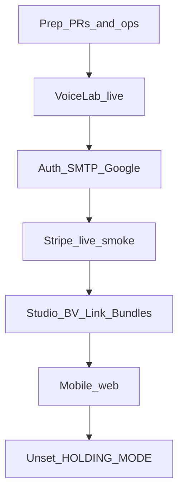

# Pre-holding-page-down launch program

## Goal

Prove the nine must-do areas on a **live Vercel Preview or Production with `HOLDING_BYPASS_TOKEN`**, then unset `HOLDING_MODE` on Production and redeploy. Do **not** flip holding until every gate below is green.

## Prerequisites (before any smoke)

1. Merge open launch-blocking PRs if not already on `main`: logo [#109](https://github.com/philipwpillar/RepurposeOne/pull/109), link-ingest UX [#110](https://github.com/philipwpillar/RepurposeOne/pull/110).
2. Confirm Production env (set together — see [docs/acceptance/phase-7-voice-lab-templates.md](docs/acceptance/phase-7-voice-lab-templates.md)):
  - `VOICE_LAB_IP_SALT` (`openssl rand -hex 32`)
  - `NEXT_PUBLIC_TURNSTILE_SITE_KEY` + `TURNSTILE_SECRET_KEY`
  - `NEXT_PUBLIC_GOOGLE_AUTH_ENABLED=true` + Supabase Google provider
  - Stripe **live** keys + webhook secret + Creator/Pro/Pro Plus price IDs
  - `NEXT_PUBLIC_SITE_URL=https://voiceora.io`
  - Leave `NEXT_PUBLIC_VIDEO_BUNDLES_DEV` **unset** (clips stay gated)
3. Supabase: `voice_lab_hits` service_role grants ([docs/acceptance/day-0-voice-lab-grants.md](docs/acceptance/day-0-voice-lab-grants.md)); OTP template includes `{{ .Token }}` and `{{ .ConfirmationURL }}` ([docs/acceptance/wave-2-auth-shell.md](docs/acceptance/wave-2-auth-shell.md)); SMTP from `support@voiceora.io`.
4. Small code/ops prep (one short PR if needed): put legal entity **GravitonForge Technologies Ltd** on Privacy/Terms ([app/privacy/page.tsx](app/privacy/page.tsx) currently only says “operated from the United Kingdom”).
5. Ops tick-box: enable Supabase **leaked-password protection**; make GitHub repo **private** (or remove `docs/briefs/independent-audit-report-*.md` from the public tree — default: **private repo**).

**How to test while holding is still on:** Production `/?preview=<HOLDING_BYPASS_TOKEN>` (cookie `vo-preview`) or a Preview deploy without `HOLDING_MODE`. Gate lives in [middleware.ts](middleware.ts).

---

## Gate 1 — Voice Lab live path

**Evidence docs:** [phase-7](docs/acceptance/phase-7-voice-lab-templates.md), [day-0](docs/acceptance/day-0-voice-lab-grants.md)  
**Code:** [app/api/voice-lab/route.ts](app/api/voice-lab/route.ts), [lib/landing/voice-lab-rate-limit.ts](lib/landing/voice-lab-rate-limit.ts)

| Step                                     | Pass criteria                                          |
| ---------------------------------------- | ------------------------------------------------------ |
| Missing salt smoke (optional on Preview) | No salt → 503 `unavailable`                            |
| Happy path                               | Landing `#voice-lab` Try it → **200** + sample thread  |
| DB                                       | One new row in `voice_lab_hits`                        |
| Turnstile                                | Widget present; bad/missing token → 403; valid → 200   |
| Rate limit                               | 6th request in ~1h → 429                               |
| IP-spoof (Preview)                       | Four curls from phase-7 doc → **same** `ip_hash`       |
| Sweep                                    | Cron/workflow_dispatch green; includes voice_lab purge |

---

## Gate 2 — Auth

**Doc:** [wave-2-auth-shell.md](docs/acceptance/wave-2-auth-shell.md)  
**Code:** [components/auth/auth-form.tsx](components/auth/auth-form.tsx), [lib/auth-config.ts](lib/auth-config.ts)

| Step               | Pass criteria                                        |
| ------------------ | ---------------------------------------------------- |
| Email signup       | Mail from `support@voiceora.io` with **6-digit OTP** |
| OTP verify         | Lands onboarding / session                           |
| Confirmation link  | `/auth/callback` establishes session                 |
| Resend             | Second email arrives                                 |
| Google (web)       | Completes OAuth when flag on                         |
| Sign-out + refresh | Session cleared; restore after re-login              |

---

## Gate 3 — Billing smoke (live Stripe)

**Key files:** [app/api/stripe/checkout/route.ts](app/api/stripe/checkout/route.ts), [portal/route.ts](app/api/stripe/portal/route.ts), [webhook/route.ts](app/api/stripe/webhook/route.ts), [payment-failed-banner.tsx](components/billing/payment-failed-banner.tsx)

| Step                             | Pass criteria                                                    |
| -------------------------------- | ---------------------------------------------------------------- |
| Free → Creator (or Pro) checkout | Redirect Account success; plan + limits shown                    |
| Portal                           | “Manage billing” opens Stripe customer portal                    |
| Cancel                           | Webhook clears paid plan / reflects cancelled                    |
| Failed payment                   | `invoice.payment_failed` → non-dismissible banner; pay clears it |

Use a real test card / Stripe test clock only if still on test mode; for **live** smoke use a small live charge you can refund immediately.

---

## Gate 4 — Studio happy path

**Docs:** [wave-4-length-presets](docs/acceptance/wave-4-length-presets.md), [wave-4-voice-variants](docs/acceptance/wave-4-voice-variants.md), [studio-fence-spec](docs/acceptance/studio-fence-spec.md)

| Step                 | Pass criteria                                                       |
| -------------------- | ------------------------------------------------------------------- |
| Paste → Generate All | X, LinkedIn, Instagram, Email complete                              |
| Library              | Outputs saved; copy/export works                                    |
| Length chips         | Format-scoped lengths apply on regenerate                           |
| Variants             | Your voice / Teach / Take each once; outputs differ enough to trust |

Optional: `bash scripts/ac-check.sh floor` locally for static gates.

---

## Gate 5 — Brand Voice wizard

**Doc:** [wave-4-brand-voice-wizard.md](docs/acceptance/wave-4-brand-voice-wizard.md)  
**Requires:** `VOICE_LAB_IP_SALT` (shared rate salt)

| Step             | Pass criteria                        |
| ---------------- | ------------------------------------ |
| Guide me → draft | Preview only; no Library burn        |
| Accept           | `brand_voices.voice_range` populated |
| Studio           | New generate uses accepted voice     |

---

## Gate 6 — Link ingest

**Doc:** [wave-3-link-ingest.md](docs/acceptance/wave-3-link-ingest.md) (+ #110 UX if merged)

| Step                    | Pass criteria                                 |
| ----------------------- | --------------------------------------------- |
| Wikipedia / public blog | Extract ≥50 chars → editable → generate       |
| Bare host (optional)    | `en.wikipedia.org/...` normalizes and works   |
| Reuters (or similar)    | Clear bot-block message; paste fallback works |
| SSRF                    | `http://127.0.0.1/` rejected                  |

---

## Gate 7 — Photo / Bundles (Pro Plus)

**Config:** [lib/config.ts](lib/config.ts) vision/bundle plan gates; video via `NEXT_PUBLIC_VIDEO_BUNDLES_DEV`

| Step                | Pass criteria                                                     |
| ------------------- | ----------------------------------------------------------------- |
| Free / Creator      | Bundles upgrade gate where expected                               |
| Pro Plus photo pack | Upload → generate → Library                                       |
| Video honesty       | No clip render UI (flag unset); “coming soon” / gated copy intact |

---

## Gate 8 — Mobile web (real phone)

**Doc:** [phase-6-mobile-ux.md](docs/acceptance/phase-6-mobile-ux.md)  
**UI:** [bottom-tabs.tsx](components/bottom-tabs.tsx), [dashboard-shell.tsx](app/(dashboard)/_components/dashboard-shell.tsx), [vo-logo-mark.tsx](components/landing/vo-logo-mark.tsx)

| Step        | Pass criteria                                     |
| ----------- | ------------------------------------------------- |
| Bottom tabs | Home / Studio / Bundles / Library usable          |
| Drawer      | Secondary nav (Brand Voice, Account)              |
| Studio      | Primary actions clear of tab bar / safe area      |
| Logo        | Landing + shell lockup not clipped; favicon loads |

---

## Gate 9 — Ops hygiene (final tick)

- [ ] Leaked-password protection ON  
- [ ] Repo private (or briefs removed)  
- [ ] `support@voiceora.io` receives and replies to a test mail  
- [ ] Privacy/Terms show **GravitonForge Technologies Ltd**  
- [ ] OpenRouter spend watch planned for 48h post-flip  

---

## Flip procedure (last)

1. Re-check Gates 1–3 on Production with bypass (Voice Lab + signup + one checkout path).
2. Vercel Production: **remove** `HOLDING_MODE` (do not leave `=false` ambiguity — unset).
3. Redeploy.
4. Incognito: `/` = full landing (not “coming soon”); `#voice-lab` works without bypass; Sign up works.
5. One anonymous Voice Lab + one signed-in Studio generate.
6. Watch Sentry + OpenRouter for 48h ([phase-7](docs/acceptance/phase-7-voice-lab-templates.md)).

## Out of scope (explicit)

- App Store / TestFlight / native Google  
- Un-gating video clips (`NEXT_PUBLIC_VIDEO_BUNDLES_DEV`)  
- Rate-limiting `/api/ingest/url` (noted residual in wave-3 acceptance; not blocking this flip)  
- Wave 3b photo reorder

