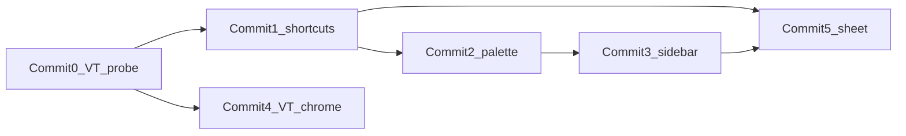

# Phase 5A — Command surface & navigation

**Branch:** `feat/ui-quality-navigation` off current `main` (`2c03d11`)  
**Do not merge. Do not bump CI. Do not touch PR #67** ([draft ratchet](https://github.com/philipwpillar/RepurposeOne/pull/67) merges last after 5B).  
**Do not edit** [`scripts/ac-check.sh`](scripts/ac-check.sh) `run_5()`.  
**Do not open** fenced Studio (`RepurposeWorkspace.tsx`), Library pages, `BundleWorkspace.tsx`, or Realtime.

`run_5()` has 8 gates; 5A only satisfies the subset below. Full `ac-check.sh 5` stays red until 5B — expected. This branch’s CI stays on phase 4.



---

## Baseline anchors

- Shell / nav: [`app/(dashboard)/_components/dashboard-shell.tsx`](app/(dashboard)/_components/dashboard-shell.tsx) — flat `NAV_ITEMS` (6), fixed `w-64` aside, top bar duplicates usage + avatar
- Auth layout mount point: [`app/(dashboard)/layout.tsx`](app/(dashboard)/layout.tsx)
- Theme boot (extend, don’t duplicate): [`app/layout.tsx`](app/layout.tsx) `themeBootScript` reading `vo-theme`
- Dialog motion already exists: [`components/ui/dialog.tsx`](components/ui/dialog.tsx) (`vo-dialog` / `vo-overlay`)
- Recent shape to reuse: [`app/(dashboard)/dashboard/page.tsx`](app/(dashboard)/dashboard/page.tsx) selects `id, target_format, output, created_at, source_hash` from `repurposes`
- Next resolved **15.5.19**; [`next.config.ts`](next.config.ts) has **no** `experimental` block yet
- Floor after every commit: `bash scripts/ac-check.sh floor; echo EXIT=$?`

---

## Commit 0 — View Transitions probe (report before 1–5)

1. Add to [`next.config.ts`](next.config.ts):

```ts
experimental: { viewTransition: true },
```

2. `npm run build` — fail the probe if Next warns about an unrecognised experimental key.
3. Temporary/trivial `view-transition-name` on one shell element; Chromium navigate between two dashboard routes and confirm a transition fires.

**Stop and report.** If the flag is rejected, cut Commit 4 (and skip the two VT 5A hand-gates); Commits 1–3 and 5 proceed unchanged.

---

## Commit 1 — `lib/shortcuts.ts` + input-guarded handler

New [`lib/shortcuts.ts`](lib/shortcuts.ts) as the only definition:

- Types: `Shortcut` with `id`, `keys`, `label`, `group: "Navigate" | "Create" | "General"`, optional `href` / `action`
- Bindings (no Studio `⌘↵` / `⌘⇧C`):
  - `mod+k` → open palette
  - chord `g` then `s|l|b|d|v|a` → Studio / Library / Bundles / Dashboard / Brand Voice / Account
  - `?` → shortcut sheet

New small client provider/hook (e.g. `components/shortcut-provider.tsx`) mounted under the dashboard layout:

1. **Write the editable guard first:** ignore when `event.target` is `input` / `textarea` / `select` / `[contenteditable=true]` (or inside one).
2. Then chord + mod handling; dispatch open-palette / open-sheet / `router.push(href)` from the registry only.

Three consumers later must import this module — no hardcoded parallel lists.

---

## Commit 2 — Command palette (`cmdk`)

- `npm install cmdk`
- New [`components/command-palette.tsx`](components/command-palette.tsx) exporting a name matching the gate (`CommandPalette` and/or `CommandDialog`)
- Wrap with existing Radix [`Dialog`](components/ui/dialog.tsx) so focus trap + `.vo-dialog` motion stay intact; do not bypass the portal
- Groups from registry: **Navigate** (6 routes), **Create** (New repurpose → `/studio`, New bundle → `/bundles`, New brand voice → `/brand-voice`), **Recent** (last 5 — fetch **lazily inside the palette on first open** via the browser Supabase client; RLS filters. Cache in component state for the session so repeated opens do not re-query. **Do not** query Recent in `app/(dashboard)/layout.tsx` — that layout already runs two queries on every authenticated route.)
- Mount in dashboard layout only (authenticated)
- Wired to `mod+k` via the shortcut provider; Esc closes; arrows + Enter work without mouse

Preserve live regions ≥ 11 (floor).

---

## Commit 3 — Sidebar collapse, nav groups, top-bar dedupe

Edit only [`dashboard-shell.tsx`](app/(dashboard)/_components/dashboard-shell.tsx) (+ the shared head boot script):

**Collapse:** expanded `w-64` (256px) ↔ icon rail `w-16` (64px). Persist `vo-sidebar-collapsed` in `localStorage`. Extend the existing `themeBootScript` in [`app/layout.tsx`](app/layout.tsx) to set a class/data attribute on `<html>` before paint (same pattern as theme — no second script, no post-hydration width flash). Collapsed links keep `aria-label`.

**Groups** (Dashboard ungrouped at top):

- Create → Studio, Bundles  
- Review → Library  
- Configure → Brand Voice, Account  

Headings: mono, uppercase, `text-[10px]`, muted (match `.eyebrow`).

**Top bar dedupe:** remove desktop avatar (and the always-on duplicate usage). Left: breadcrumb (section + page context when available). Right: `⌘K` affordance; usage meter **only when sidebar is collapsed**. Avatar stays in sidebar footer + mobile drawer.

**Mobile drawer unchanged** in 5A.

---

## Commit 4 — Route View Transitions (only if Commit 0 passed)

- `view-transition-name` on persistent chrome (sidebar + top bar) so the frame holds while main content crossfades
- Durations from existing `--motion-*`; confirm the global `prefers-reduced-motion` path disables transitions (verify, don’t duplicate)
- **No** Library→detail shared-element work (5B)

---

## Commit 5 — `?` shortcut sheet

- Dialog listing every shortcut **generated from** [`lib/shortcuts.ts`](lib/shortcuts.ts) (grouped)
- Reachable via `?` and from the palette (“Keyboard shortcuts”)
- No hardcoded duplicate list

---

## Gates (5A hand-check; do not edit `run_5`)

```bash
rg -c 'CommandDialog|CommandPalette' app components   # ge 1
rg -c '"cmdk"' package.json                          # ge 1
ls lib/shortcuts.ts                                  # exists
rg -c 'view-transition-name|viewTransitionName' app components  # ge 2 (skip if C0 failed)
rg -c 'viewTransition' next.config.ts                # ge 1 (skip if C0 failed)
rg -c 'vo-sidebar-collapsed' app components          # ge 2
rg -c 'Create|Review|Configure' 'app/(dashboard)/_components/dashboard-shell.tsx'  # ge 3
```

Still red until 5B: library pagination, JobTray, realtime, `docs/acceptance/phase-5-*.md`.

**Done when:** floor EXIT=0; `ac-check.sh 4` EXIT=0; contrast / tsc / lint / Playwright green; keyboard walkthrough (palette → all six routes → `?` → collapse/expand) with no mouse; `node e2e/capture.mjs` for collapsed+expanded × both themes; **PR open, not merged**.

---

## Explicit exclusions

- No Studio shortcuts; no fence edits  
- No CI ratchet; leave [#67](https://github.com/philipwpillar/RepurposeOne/pull/67) draft  
- No Library / Realtime / job tray / shared-element  
- No mobile drawer / bottom-tab changes  
- No second localStorage bootstrap script  
