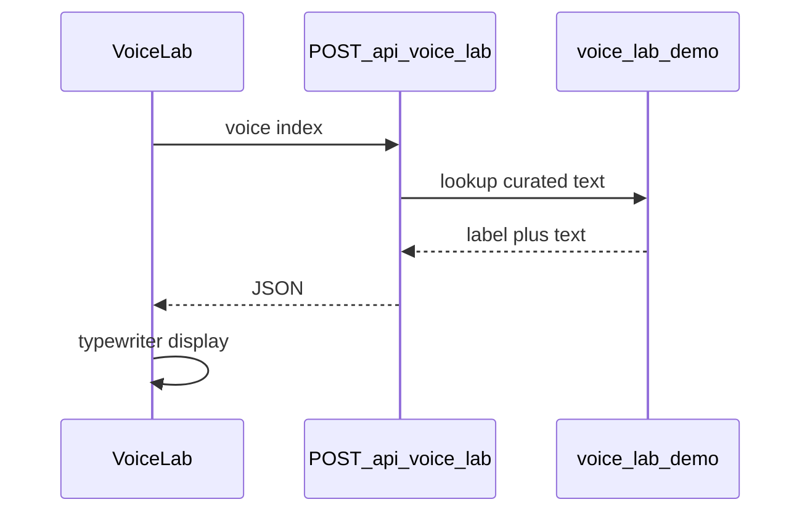

# Phase 7 — Voice Lab API + Studio templates

Branch from `main`: `feat/phase-7-voice-lab-templates`.

Gates ([scripts/ac-check.sh](scripts/ac-check.sh) `run_7()`):

| Gate | Current | Target |
|------|---------|--------|
| `fetch(` in [components/landing/voice-lab.tsx](components/landing/voice-lab.tsx) | 0 | ge 1 |
| [app/api/voice-lab/route.ts](app/api/voice-lab/route.ts) exists | missing | eq 1 |
| No numeric social proof in `app/` + `components/` | already 0 | stay 0 |
| [lib/repurpose/templates.ts](lib/repurpose/templates.ts) exists | missing | eq 1 |
| Hex gate clean | pass | stay pass |
| OG pack (6 files) | pass | stay pass |
| [docs/acceptance/phase-7-*.md](docs/acceptance/) | missing | eq 1 |

**Default for Voice Lab API:** curated server responses (no OpenRouter). Matches the existing “Illustrative demo · sample voices” label, avoids public-landing cost/abuse, and still satisfies “real route.” Live AI can be a later opt-in; not in this PR.

---

## 1. Public demo API — `POST /api/voice-lab`

New [app/api/voice-lab/route.ts](app/api/voice-lab/route.ts):

- **Public** (no auth) — landing visitors only
- Body: `{ voice: 0 | 1 | 2 }` (maps to Punchy founder / Warm storyteller / Precise analyst)
- Fixed source idea: `"We just shipped photo input."` (same as current UI)
- Response: `{ voice, label, format: "linkedin", text }` from a server-side curated map (move today’s [VOICE_LAB_COPY](components/landing/voice-lab.tsx) into `lib/landing/voice-lab-demo.ts` so client and server share one source of truth)
- Light abuse guard: in-memory or simple IP rate limit (e.g. 30 req / 10 min); 429 with clear message
- No DB writes, no billing, no OpenRouter



---

## 2. Wire [components/landing/voice-lab.tsx](components/landing/voice-lab.tsx)

- On chip click (and initial mount for voice 0): `fetch("/api/voice-lab", { method: "POST", ... })`
- Keep typewriter + reduced-motion behavior
- On fetch failure: fall back to local curated copy (same strings) so the section never goes blank
- Keep honesty footer: “Illustrative demo · sample voices, sample copy”
- Do not invent user counts / star ratings (social-proof gate)

---

## 3. Studio templates — [lib/repurpose/templates.ts](lib/repurpose/templates.ts)

Create a small catalog (concrete set of **4** starters):

| id | Title | Role |
|----|-------|------|
| `newsletter-to-platforms` | Newsletter → platforms | Current [STUDIO_EXAMPLE_INPUT](lib/repurpose/studio-example.ts) content |
| `product-launch` | Product launch note | Short launch announcement |
| `founder-lesson` | Founder lesson | Reflective founder post |
| `customer-story` | Customer win | Mini case-study seed |

Export: `StudioTemplate` type, `STUDIO_TEMPLATES[]`, `getStudioTemplate(id)`, and keep `STUDIO_EXAMPLE_INPUT` as an alias of the first template’s body (or re-export from templates) so [app/(dashboard)/studio/page.tsx](app/(dashboard)/studio/page.tsx) `?example=1` stays backward-compatible.

**Studio UI (minimal, gate-complete):**

- Add `?template=<id>` support in `studio/page.tsx` (alongside `example` / `reuse`)
- In Studio paste mode, a compact “Try a template” row (chips or select) that fills the textarea from `STUDIO_TEMPLATES` without auto-generating (user still hits Generate) — avoids surprise AI spend
- Prefer a thin client helper importing from `lib/repurpose/templates.ts`; avoid bloating [RepurposeWorkspace.tsx](app/(dashboard)/studio/_components/RepurposeWorkspace.tsx) beyond a small prop/`onApplyTemplate` hook if needed

---

## 4. Honesty / OG / hex

- Sweep landing + components after edits; social-proof regex must stay at 0
- Do not add raw hex outside allowlist
- Leave OG pack files untouched

---

## 5. CI + acceptance + visuals

- Ratchet [.github/workflows/ci.yml](.github/workflows/ci.yml) phase gate from `8` → `7` **or** run both `8` and `7` (prefer **keep 8 + add 7**, same pattern as wave1, so Phase 8 stays enforced)
- Write [docs/acceptance/phase-7-voice-lab-templates.md](docs/acceptance/phase-7-voice-lab-templates.md)
- **Visual baselines:** if Voice Lab / landing pixels change, regenerate via `gh workflow run visual-baselines.yml` in `mcr.microsoft.com/playwright:v1.62.0-noble` and commit `*-linux.png` (bump Playwright package + image tag together if ever changing versions)

---

## 6. Out of scope

- Live OpenRouter on the public Voice Lab
- Holding-page takedown / SMTP / Supabase Auth / Stripe / iOS ops
- Waves 2–3 (OTP, Child Mode, link ingest, etc.)
- Changing visual project architecture

---

## Verification

```bash
bash scripts/ac-check.sh 7
bash scripts/ac-check.sh 8
bash scripts/ac-check.sh wave1
npm run typecheck
# Manual: landing #voice-lab chips hit /api/voice-lab; Studio template chip fills paste box
```

Stop after PR open; merge only when you say so.
