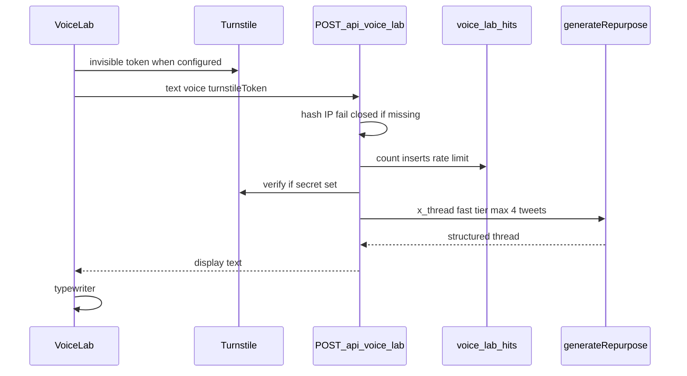

# Phase 7 — Live Voice Lab + Studio templates

Branch from `main`: `feat/phase-7-voice-lab-templates`.

**Amendment:** the curated `/api/voice-lab` approach is **replaced**. Templates (section below) stay as previously approved.

**Locked decision — moderation:** accept for launch (no keyword filter, no moderation API). Document in the acceptance note as a considered tradeoff: output is visitor-only, nothing stored. Revisit if abuse appears.

---

## What changes for the visitor

[`components/landing/voice-lab.tsx`](components/landing/voice-lab.tsx) stops being a rotating canned LinkedIn carousel. It becomes:

1. Textarea pre-filled with a short replaceable example
2. Three sample-voice chips (Punchy founder / Warm storyteller / Precise analyst)
3. **Try it** → live X thread typewriter from *their* text
4. CTA: one format now; sign up for all four in *their* voice
5. Honesty: **Generated live · sample voice, your text**
6. Inline privacy line under the textarea: *Your text is sent to our AI provider (DeepInfra, US) to generate the demo. We don't store it.*

Keep typewriter + `prefers-reduced-motion`. Never blank the section.



---

## 1. Live demo API — `POST /api/voice-lab`

New [`app/api/voice-lab/route.ts`](app/api/voice-lab/route.ts) — public, no auth, **no** `repurposes` write, **no** logging of body/output.

**Reuse the real pipeline** — call [`generateRepurpose()`](lib/ai/generate.ts) directly with:

- `targetFormat: "x_thread"`
- `targetTweets: 4`
- `modelTier: "fast"` (qwen fast tier — inherits `OPENROUTER_ALLOWED_PROVIDERS`)
- Hardcoded sample `BrandVoiceInput` per voice index (description + short samples; not visitor voice)

**Caps (shared constant `VOICE_LAB_MAX_CHARS = 1500`):**

| Cap | Value |
|-----|-------|
| Input chars | 1500 client + server |
| Tweets | 4 |
| `max_tokens` | 400 |
| Formats | `x_thread` only |

[`generateRepurpose`](lib/ai/generate.ts) today has no `max_tokens` — add optional `maxTokens?: number` on `GenerateInput` and pass through to the OpenRouter completion params. Still truncate demo input at 1500 **before** calling (do not rely on `AI_CONFIG.maxInputChars` alone).

**Rate limit — DB-backed (not in-memory):**

- Migration: `voice_lab_hits (id, ip_hash, created_at)` + index `(ip_hash, created_at desc)`, RLS on, **no policies**, plus explicit `revoke all on public.voice_lab_hits from anon, authenticated` (service-role only via [`createAdminClient`](lib/supabase/admin.ts))
- `ip_hash = sha256(ip + VOICE_LAB_IP_SALT)`; require `VOICE_LAB_IP_SALT` at runtime (missing salt → 503, not a shared `undefined` bucket)
- **Client IP resolution (Vercel-aware — corrected from brief’s “first XFF”):**
  1. Prefer `x-vercel-forwarded-for` (platform header; same value as XFF but not rewritten by an upstream proxy on top of Vercel)
  2. Else `x-real-ip`
  3. Else `x-forwarded-for` — take the **first** entry only when it is a single-hop / Vercel-overwritten chain (Vercel docs: platform **overwrites** XFF and does not forward client-supplied external IPs on direct Vercel traffic)
  4. No plausible IP → **429** (fail closed)
  - Do **not** use “last XFF entry” as the primary rule on Vercel-direct hosting — that is the generic append-proxy heuristic; on Vercel the trustworthy hop is the one the edge sets (documented as the public client IP / first after overwrite).
  - **Pre-merge empirical check (Preview):** curl twice — clean vs `-H "x-forwarded-for: 1.2.3.4"` — both must land on the **same** `ip_hash` in `voice_lab_hits`. If hashes diverge, the header choice is wrong; fix before merge.
- Limits: **5/hour**, **20/day** per hash
- Extend [`app/api/cron/sweep-pending-repurposes/route.ts`](app/api/cron/sweep-pending-repurposes/route.ts): **keep the cron path** (pinned in `vercel.json` + Actions), but add a clearly named step + update the file header comment (e.g. “also purge `voice_lab_hits` older than 48h”) so the route name is not silently lying

**Turnstile — env-gated:**

- Verify token server-side before AI when `TURNSTILE_SECRET_KEY` is set; **unset = skip** (local/CI green)
- Client uses `NEXT_PUBLIC_TURNSTILE_SITE_KEY` when present

**Failure responses mapped in UI:**

- 429 → *You've had a few goes — sign up free to keep going.*
- Turnstile fail → *Couldn't verify — refresh and try again.*
- AI/timeout → fall back to curated sample string + restore honest fallback label; `Sentry.captureException`

Keep curated fallback strings in e.g. [`lib/landing/voice-lab-demo.ts`](lib/landing/voice-lab-demo.ts) for that path only.

Format API success as a single display string (joined tweets) suitable for the existing typewriter.

---

## 2. Wire Voice Lab UI

Rewrite [`components/landing/voice-lab.tsx`](components/landing/voice-lab.tsx):

- Remove auto-rotate of canned LinkedIn copy as the primary mechanic
- Textarea + voice chips + Try it → `fetch("/api/voice-lab", …)`
- Footer format: **X thread** (not LinkedIn)
- Honesty label as above; no numeric social proof
- Optional Turnstile widget/script only when site key is set

---

## 3. Compliance copy

- Point-of-input notice in Voice Lab (DeepInfra / no store)
- New section on [`app/privacy/page.tsx`](app/privacy/page.tsx): anonymous demo processing, legitimate interest, US transfer, IP-hash retention 48h
- Bump “Last updated” date

---

## 4. Studio templates — unchanged from prior approval

[`lib/repurpose/templates.ts`](lib/repurpose/templates.ts) with 4 starters (`newsletter-to-platforms`, `product-launch`, `founder-lesson`, `customer-story`); `?template=` + “Try a template” chips; keep `?example=1` via shared/re-exported body.

---

## 5. AC gates — replace Voice Lab asserts in `run_7()`

Update [`scripts/ac-check.sh`](scripts/ac-check.sh) per the brief (drop weak `fetch(`-only pass):

- route exists
- `generateRepurpose` in voice-lab route
- `voice_lab_hits` referenced ≥2 across route + lib
- `createHash|sha256` in route
- `VOICE_LAB_MAX_CHARS` ≥3 across app/components/lib
- `TURNSTILE_SECRET_KEY` in route
- `Illustrative demo` count in `components/landing` = 0
- `DeepInfra` ≥2 across voice-lab + privacy page
- Keep existing: templates file, no social proof, hex, OG pack, acceptance doc

---

## 6. CI + acceptance + visuals

- CI: **keep phase 8 + add phase 7**
- [`docs/acceptance/phase-7-voice-lab-templates.md`](docs/acceptance/phase-7-voice-lab-templates.md): live demo, caps, rate limits, Turnstile, moderation accept-for-launch, ops checklist
- Regen visual baselines if landing pixels change (`visual-baselines.yml` / Playwright `v1.62.0-noble`)

---

## Ops before holding page down (document only — not this PR)

**Order matters:** set `VOICE_LAB_IP_SALT` **before** the route ever serves production traffic (same batch as Turnstile keys) — otherwise hashes collapse onto a shared empty-salt bucket.

1. `VOICE_LAB_IP_SALT` (`openssl rand -hex 32`) + `NEXT_PUBLIC_TURNSTILE_SITE_KEY` + `TURNSTILE_SECRET_KEY` on Vercel (together)
2. Apply `voice_lab_hits` migration manually; commit SQL file
3. Preview IP-spoof curl check (see rate-limit section) before promoting
4. Watch OpenRouter spend 48h after public

---

## Out of scope

- Multi-format demo, visitor-supplied voice samples, save-demo-to-account, streaming demo  
- Waves 2–3, holding-page / SMTP / Auth / Stripe / iOS ops  

---

## Verification

```bash
bash scripts/ac-check.sh 7
bash scripts/ac-check.sh 8
bash scripts/ac-check.sh wave1
npm run typecheck
# Manual: paste text → Try it → X thread; hit rate limit; AI fail → curated fallback
# Studio: template chip fills paste; ?example=1 still works
# Preview: curl clean vs spoofed XFF → same voice_lab_hits.ip_hash
```

Stop after PR; merge only when you say so.
