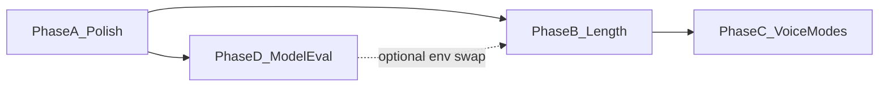

# Polish, length, voice modes, and model review

**Defaults locked for this plan** (change before implement if wrong):
- **Voice modes** are a **style overlay** on Brand Voice (identity stays; mode chips change delivery), matching Voice Lab today.
- **Sequencing:** Phase A polish can ship anytime; Phases B–C are **Wave 4** and **supersede Wave 3c** Concise/Standard/Detailed with word-count presets. Do not implement the old 3c labels.
- **Logo (#6):** deferred until you supply assets.

---

## Phase A — Quick polish (items 2–5)

Small UI-only PR; no prompt/schema changes.

### 2. Matching font size (input vs result)
Studio already uses `text-sm` for both sides. The mismatch is **Voice Lab only**:
- [app/landing.css](app/landing.css): `.lab-input` is **15px**, `.out-text` is **17px**
- Set both to **15px** (or both 16px) so “your text” and the result read the same.

### 3. Start Case headlines
Exact targets:
- [components/landing/voice-lab.tsx](components/landing/voice-lab.tsx): `Same Idea. Different Voice.`
- [app/page.tsx](app/page.tsx) + [app/opengraph-image.tsx](app/opengraph-image.tsx): `One Piece Of Content.` / `Every Platform.` / `Your Voice.`
- Update [e2e/landing.anon.spec.ts](e2e/landing.anon.spec.ts) assert if it keys off casing.
- Leave metadata strings (`Voiceora — one piece of content…`) alone unless you want SEO titles Start-Cased too (not in this phase).

### 4. Remove em dashes from all pages/text
AI path already bans + strips (`PUNCTUATION_RULE` in [lib/ai/prompts.ts](lib/ai/prompts.ts), [lib/ai/strip-em-dashes.ts](lib/ai/strip-em-dashes.ts)). Gap is **product/marketing UI** (~65–70 `—` in app/components).

- Sweep `.tsx` user-visible copy (landing, auth, Studio banners, privacy/terms, metadata in [app/layout.tsx](app/layout.tsx)).
- Replace with commas, periods, colons, or spaced hyphen ` - ` (same rule as AI).
- Add a cheap AC grep in `scripts/ac-check.sh` for `—` under `app/` + `components/` (exclude comments if noisy).
- Docs/plans `.md` are out of scope unless you want them cleaned too.

### 5. White → very light grey
In [app/globals.css](app/globals.css) light theme:
- `--paper-elevated`: `#ffffff` → `#f7f8fb` (or reuse `#fafbfc` from `--paper-elevated-2`)
- `--surface-1` / `--card`: same shift
- Keep `--surface-0` / `--paper` as the slightly greyer canvas so elevation still reads
- Spot-check contrast on `--input` borders and primary buttons (AA on elevated surfaces)
- Do **not** change `.chrome-dark` / ink panels

### 6. Logo
No code until new mark lands. Touchpoints later: [components/landing/vo-logo-mark.tsx](components/landing/vo-logo-mark.tsx), `app/icon.tsx` / `apple-icon.tsx`, iOS AppIcon assets.

---

## Phase B — Word-count length (items 1 + 8; replaces Wave 3c)

Update the Wave 3 plan todo `w3-length` to point here.

### Voice Lab preview size (#1)
Presets: **~20 / ~50 / ~75 / ~100 words** (default ~50).

| Piece | Change |
|---|---|
| UI | Size chips next to voice chips in [components/landing/voice-lab.tsx](components/landing/voice-lab.tsx) |
| API | Accept `target_words` in [app/api/voice-lab/route.ts](app/api/voice-lab/route.ts); validate enum |
| Caps | Scale `targetTweets` + `maxTokens` from word preset (today fixed 4 tweets / 400 tokens in [lib/landing/voice-lab-config.ts](lib/landing/voice-lab-config.ts)) |
| Prompt | Pass approximate word budget into `generateRepurpose` / X-thread builder |

Rate limits stay 5/hr, 20/day. Larger presets cost more tokens — keep demo on **fast** tier.

### Studio output size (#8)
Presets: **~10 / ~20 / ~50 / ~75 / ~100 / ~200 words** (default ~50), shared control in [RepurposeWorkspace.tsx](app/(dashboard)/studio/_components/RepurposeWorkspace.tsx).

- Wire through generate + stream schemas (`target_words` or `length_preset`)
- Prompt modifiers in [lib/ai/prompts.ts](lib/ai/prompts.ts) per format; **always clamp** to existing hard caps (X ≤280/tweet, LinkedIn ≤3000 chars, Instagram ≤2200, email subject/preview limits)
- X threads: map word budget → tweet count band (keep 3–15 slider as advanced, or derive from words and hide slider — **derive from words**, drop the old tweet slider to avoid two competing controls)
- Persist last choice in `localStorage` (same spirit as planned Wave 3c font prefs; skip S/M/L font UI unless you still want it — not in your list)

Branch: `feat/wave4-length-presets`

---

## Phase C — Voice modes + brand-voice guide (items 7 + 9)

### Voice modes for all content (#7)
Today Studio has Brand Voice profiles only; Voice Lab has three hardcoded modes in [lib/landing/voice-lab-config.ts](lib/landing/voice-lab-config.ts).

**Product model:** Brand Voice = *who you are*; Voice Mode = *how this piece should land*.

1. Extract shared mode catalog (labels + system prompt fragments + optional sample lines) used by Voice Lab **and** Studio
2. Studio: mode chips on every generate (paste/link/photo); include **Custom** → short free-text style note (or “save as mode” later)
3. Inject mode block beside `buildBrandVoiceBlock()` in [lib/ai/prompts.ts](lib/ai/prompts.ts)
4. Bundles: same mode selector (or inherit Studio default)
5. Optional later: persist user custom modes in DB — **v1 = session/local Custom text only** to avoid schema churn before launch

### Brand voice creation guide (#9)
Extend [BrandVoiceManager.tsx](app/(dashboard)/brand-voice/_components/BrandVoiceManager.tsx) with a short wizard:

1. Questions: audience, tone words, do/don’t, 1–3 writing samples (reuse existing sample fields)
2. `POST` new endpoint (auth’d) that returns a structured **AI brand-voice summary** (description + suggested name) via existing OpenRouter/DeepInfra path
3. User reviews/edits, then saves as a normal `brand_voices` row

Honesty copy: summary is a starting point; samples still matter most.

Branch: `feat/wave4-voice-modes-guide`

---

## Phase D — Is Qwen still best? (#10)

**Constraint that decides the shortlist:** production pins `OPENROUTER_ALLOWED_PROVIDERS = ["deepinfra/fp8"]` in [lib/config.ts](lib/config.ts). Anything not served as that tag 404s.

### Live findings (2026-07-30)

| Model | OpenRouter slug | DeepInfra on OpenRouter | vs current cost (approx) | Fit |
|---|---|---|---|---|
| Current strong | `qwen/qwen3.5-397b-a17b` | `deepinfra/fp8` | $0.45 / $3.00 | Keep baseline; note DeepInfra endpoint recently showed poor uptime in OpenRouter status — worth watching |
| Current fast | `qwen/qwen3.5-35b-a3b` | `deepinfra/fp8` | $0.14 / $1.00 | Baseline |
| **Qwen3.6 35B** | `qwen/qwen3.6-35b-a3b` | **`deepinfra/fp8`** | ~$0.10 / $0.95 | Best **in-family upgrade** for fast (and possible strong if voice holds) |
| Kimi K2.6 | `moonshotai/kimi-k2.6` | **`deepinfra/fp4` only** | ~$0.75 / $3.50 | **Not usable** without allowlisting `deepinfra/fp4` (same company; GDPR location OK per runbook, but code change required) |
| Qwen3.7 Max/Plus | various | mixed; Max often text-only / non-fp8 | much higher | Evaluate only if multimodal + DeepInfra pin works |
| GLM-5.x | `z-ai/glm-5*` | verify per slug | varies | Only if DeepInfra + vision needs met |

DeepInfra catalog also lists Kimi K2.6/K2.7-Code and newer Qwen3.6/3.7 directly; **our path is OpenRouter → provider pin**, so catalog alone is not enough.

### Recommended eval (no auto-swap)
Follow [docs/runbooks/model-failover.md](docs/runbooks/model-failover.md) voice-parity protocol (still unrun as of 2026-07-26):

1. Spike with `scripts/spike-stream.mjs` + real brand voice: **current 397B** vs **qwen3.6-35b-a3b** vs (if you approve allowlist expand) **kimi-k2.6** via `deepinfra/fp4`
2. Side-by-side: X thread + LinkedIn + Instagram + one photo path
3. Score: voice fidelity, JSON reliability, latency, $/1k generates
4. Decision: keep Qwen3.5; bump fast→3.6; or trial Kimi only after `OPENROUTER_ALLOWED_PROVIDERS` includes `deepinfra/fp4` (and confirm ZDR/US still matches privacy copy)

**Do not** silent-failover mid-incident to Kimi; brand voice is the product.

---

## Suggested ship order

1. **Phase A** — polish PR (`feat/ux-polish-greys-copy`)
2. **Phase D spike** (read-only eval doc + optional env trial on Preview) — can parallel Phase A
3. **Phase B** — length presets
4. **Phase C** — voice modes + brand-voice wizard
5. Logo when assets ready

Keep web-launch blockers (holding mode, Turnstile, etc.) on the existing Wave 3 track; this work should not block holding-off unless you want polish on the public landing first (Phase A is landing-heavy and is a good pre-launch pass).
