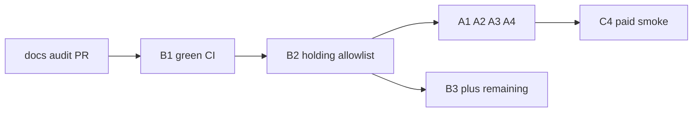

# Voiceora rectification — execution plan

Baseline: `83e43e9`. Follows [VOICEORA_RECTIFICATION_PLAN.md](/Users/philipwpillar/Library/Application Support/Claude/local-agent-mode-sessions/cb784fd5-8f4c-4f5b-8c17-cccfadbad4f0/9dc9a248-f527-4a1e-a08e-a6a45d78b73a/local_65651b81-e0d1-4c8d-9074-63333ac13588/outputs/VOICEORA_RECTIFICATION_PLAN.md) with one ordering fix: **deploy B2 before changing the live webhook URL / replaying events**, so deliveries hit the real handler under `HOLDING_MODE`.

## Decisions locked in

- **Em-dash gate:** keep repo-wide ban on `app/` + `components/` (option a). Only fix the offending comment; do not weaken the gate.
- **Holding allowlist:** add `/api/stripe/webhook` only (not `/api/stripe`), plus `/privacy` and `/terms`.
- **Webhook URL change (A1):** after B2 is on Production, not before.
- **Track D items:** leave deferred/accepted as written; do not open briefs for them now.

## Phase 0 — Ship the audit record

Current branch `docs/full-audit-2026-08-04` has uncommitted `[docs/full-audit-2026-08-04.md](docs/full-audit-2026-08-04.md)`.

- Commit that file only (ignore `.cursor/settings.json`)
- Push + open PR into `main`
- Stop; you merge after Claude verifies

## Phase 1 — B1: Restore green CI (P0, first code PR)

Fresh branch from `main` after Phase 0 merges (or from current `main` if you merge audit later — B1 must not depend on the audit doc).

**Touch:**

- `[components/repurpose/upgrade-prompt.tsx](components/repurpose/upgrade-prompt.tsx)` line 48 — replace `—` with a spaced hyphen in the JSDoc
- `[docs/acceptance/wave-4-ux-polish.md](docs/acceptance/wave-4-ux-polish.md)` — one-line note that the dash ban stays repo-wide including comments

**Accept:** `bash scripts/ac-check.sh floor` PASS; CI green on the PR.

**Out of scope:** any other copy or gate changes.

## Phase 2 — B2: Holding allowlist + `/bundles` protection (P0)

Fresh branch from green `main`.

**Touch:**

- `[middleware.ts](middleware.ts)`: add `/api/stripe/webhook`, `/privacy`, `/terms` to `HOLDING_ALLOWLIST`; early-return for webhook (and cron if not already) **before** `updateSession` so Stripe avoids a useless Supabase round-trip
- `[lib/supabase/middleware.ts](lib/supabase/middleware.ts)`: add `/bundles` to `PROTECTED_PREFIXES`

**Accept (Preview with `HOLDING_MODE=true`):**

- `POST /api/stripe/webhook` → signature failure JSON/text, **not** holding HTML
- `/privacy` and `/terms` render real pages
- `/`, `/studio`, `/sign-in` still rewrite to holding
- unauthenticated `/bundles` redirects from middleware

**Out of scope:** unsetting `HOLDING_MODE`; exposing checkout/portal under holding.

## Phase 3 — Phil ops (parallel checklist; Cursor does not execute)

After B2 is merged and deployed to Production:

1. **A1** — Stripe webhook URL → `https://www.voiceora.io/api/stripe/webhook`; GitHub `APP_URL` → same host
2. **A2** — register `invoice.paid` (five events total)
3. **A3** — replay swallowed 200-HTML deliveries since holding went up
4. **A4** — reconcile 4 `profiles` rows vs live Stripe (service-role SQL only)
5. Same window: **A5** Sentry, **A6** confirm video flag ≠ `true`, **A7** leaked-password protection

Cursor stays available to interpret replay/reconcile mismatches if asked.

## Phase 4 — Next Cursor briefs (after B2; do not block ops)

Separate PRs, in order:

| Brief                                                                                         | Why next                                                                   |
| --------------------------------------------------------------------------------------------- | -------------------------------------------------------------------------- |
| **B3** server `VIDEO_BUNDLES_ENABLED` gate                                                    | Closes UI-only flag hole before any video un-gate                          |
| **B4** `maxDuration` on `/api/generate` (+ sibling routes); ingest rate limit                 | Set `maxDuration=60` now on Hobby; raise later if you take Vercel Pro (A9) |
| **B6** fail-closed on bundle video asset select                                               | Small, correctness                                                         |
| **B5** usage display = reservation view                                                       | UX honesty near cap                                                        |
| **B7** `.env.example` + AC Capacitor assert + HSTS raise (**no preload**) + stale ASR doc fix | Truth-up                                                                   |
| **B8** e2e Voice Lab / ingest / delete / photo bundle                                         | After launch-critical path                                                 |

## Phase 5 — Go-live gate (Phil)

Do **not** unset `HOLDING_MODE` until rectification go-live checklist is green: A1–A4, B1–B2, C4 paid smoke (including failure banner clear via `invoice.paid`), C2 Voice Lab preview probe, C3 Railway health, A10/A11 as required for real users.

## What I will implement when you approve

Start immediately with **Phase 0** (audit docs PR) then **Phase 1 (B1)** unless you say skip the docs PR and go straight to B1. Each phase: new branch, PR, no merge.