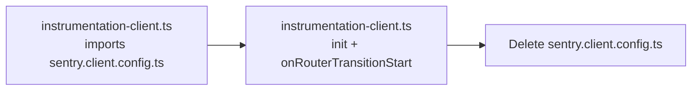

# B9 — Sentry client instrumentation

## Goal

Production Sentry is live but client App Router navigations are not instrumented, and the build emits four real SDK warnings. This PR closes that capture gap and migrates deprecated build options. It is deliberately separate from B7 (docs/headers).

**Branch:** `fix/sentry-client-instrumentation` (from clean `main`)

## Confirmed current state

- [`instrumentation-client.ts`](instrumentation-client.ts) is a one-line re-export: `import "./sentry.client.config"`
- [`sentry.client.config.ts`](sentry.client.config.ts) holds the only client `Sentry.init` (DSN from `NEXT_PUBLIC_SENTRY_DSN`, `tracesSampleRate: 0.1`, `sendDefaultPii: false`)
- [`instrumentation.ts`](instrumentation.ts) already exports `onRequestError = Sentry.captureRequestError` (server symmetry to mirror)
- [`next.config.ts`](next.config.ts) still uses deprecated top-level `disableLogger` / `automaticVercelMonitors`
- `@sentry/nextjs@10.68.0` types confirm the migration path:
  - `disableLogger` → `webpack.treeshake.removeDebugLogging`
  - `automaticVercelMonitors` → `webpack.automaticVercelMonitors`
  - `Sentry.captureRouterTransitionStart` is exported from the client SDK



## Implementation steps

### 1. Inline client init + navigation hook

Replace [`instrumentation-client.ts`](instrumentation-client.ts) with the full init (byte-for-byte options from the current client config) plus:

```ts
export const onRouterTransitionStart = Sentry.captureRouterTransitionStart;
```

Then **delete** [`sentry.client.config.ts`](sentry.client.config.ts). Do not change `sendDefaultPii`, `tracesSampleRate`, or DSN handling.

### 2. Migrate `withSentryConfig` options in [`next.config.ts`](next.config.ts)

Move the two deprecated keys under `webpack`, leaving everything else unchanged (`silent`, org/project/authToken, `widenClientFileUpload`, `sourcemaps.disable` gated on `SENTRY_AUTH_TOKEN`):

```ts
webpack: {
  treeshake: { removeDebugLogging: true },
  automaticVercelMonitors: false,
},
```

Let `tsc` confirm. If types disagree with the warning text, follow types and note it in the PR.

### 3. Update acceptance record

In [`docs/acceptance/phase-8-sentry-visual.md`](docs/acceptance/phase-8-sentry-visual.md) (line 17 table row), describe the new layout: client init lives in `instrumentation-client.ts`; server/edge configs unchanged. Add a short dated note explaining why (Turbopack + `onRouterTransitionStart`).

### 4. Floor gate in [`scripts/ac-check.sh`](scripts/ac-check.sh)

Add inside `run_floor()`:

```bash
assert "sentry nav instrumentation"  "$(n 'onRouterTransitionStart' instrumentation-client.ts)" ge 1
```

Do **not** lower `run_8()`'s `ls sentry.*.config.* ge 2` (will sit at exactly 2 after deleting the client file). Prove the new gate trips on a scratch copy before push.

## Out of scope (per brief)

- No Sentry wizard
- No edits to `sentry.server.config.ts` / `sentry.edge.config.ts`
- No sampling/PII/DSN changes, no iOS shell, no broader hardening (beforeSend, replay, segment error boundaries, worker)

## Verification

1. `npm run typecheck` and `npm run build` exit 0
2. `bash scripts/ac-check.sh floor` and `bash scripts/ac-check.sh 8` pass
3. After push + Preview deploy: build log has **none** of the four warning strings, and still shows successful source-map upload (`Uploaded files to Sentry`, org `gravitonforge-technologies-ltd`, project `voiceora`)
4. Paste that build-log excerpt into the PR body

Standard workflow: feature branch → commit → push → open PR → **do not merge**. Runtime client-nav capture is not claimable from a green build alone.