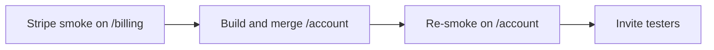
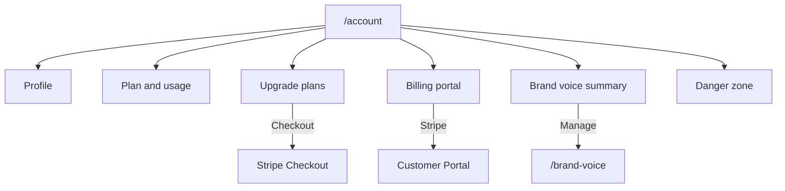

# Unified Account Page

## Sequencing (hard gate)

Do **not** interleave this refactor with the first live Stripe smoke.

1. **Now:** run Stripe live smoke on the **current** `/billing` shape (Checkout → plan on billing → portal → cancel → webhook). That surface is already hardened and stable.
2. **Then:** implement and merge this Account page PR.
3. **Then:** re-run the **same** smoke once against `/account` (and `/account?checkout=…`) before inviting testers.

Reason: this PR touches checkout return URLs, portal entry, middleware protected routes, and redirects. Landing it before the first smoke makes revenue failures look like Stripe/webhook bugs when they may be route regressions — the same “scope before revenue” pattern that has bitten this project before.

---

## Product shape (Cursor-style)

One page at **`/account`** with stacked sections (left sticky mini-nav on desktop optional; mobile = sequential). **Brand Voice stays at `/brand-voice`** (full CRUD workspace) with a summary card + link on Account — same pattern as Cursor keeping Rules/Models off the Account surface.

### Sections to ship

| Section | Contents | Source today |
|---|---|---|
| **Profile** | Avatar, display name (editable), email (read-only), signed-in via Google/email hint, **Sign out** | Auth `user` / `user_metadata`; `SignOutButton` |
| **Plan & usage** | Current plan badge; gens used/limit/remaining this calendar month; Pro Plus also shows Moment Bundles used/`BUNDLE_MONTHLY_LIMIT` (30); link to Library | `checkUsageLimit`; `count_monthly_bundles` RPC + [`BUNDLE_MONTHLY_LIMIT`](lib/config.ts) |
| **Upgrade** | Existing Creator / Pro / Pro Plus cards + checkout | Move [`UpgradePlans`](app/(dashboard)/billing/_components/UpgradePlans.tsx) |
| **Billing** | “Manage billing” → Stripe portal (invoices, payment method, cancel/downgrade); inline note when `payment_failed_at` is set (banner in shell stays) | `POST /api/stripe/portal`; profile flags |
| **Brand voice** | Default voice name/snippet + “Manage brand voices” → `/brand-voice` | `brand_voices` query |
| **Danger zone** | Existing delete flow (type `DELETE`) | [`DeleteAccountForm`](app/(dashboard)/settings/account/_components/DeleteAccountForm.tsx) |

### Explicitly not in this PR

- Email change / password change / avatar upload (Supabase flows exist but need confirmation UX; ship read-only email + editable display name only).
- Notifications preferences (bell still stub).
- Embedding full Brand Voice CRUD on Account.
- Redesigning Dashboard usage cards (keep as overview; their Upgrade CTAs retarget `/account`).

---

## URL & nav consolidation

| Old | New |
|---|---|
| `/billing` | Redirect → `/account` (preserve `?checkout=success\|cancelled`) |
| `/settings/account` | Redirect → `/account#danger` |
| `/upgrade` | Already redirects; retarget destination to `/account` |
| Nav: Billing + Account | Single **Account** item → `/account` |
| Shell usage “Upgrade” links | → `/account` |
| Privacy delete link | → `/account#danger` |
| Upgrade gates / prompts | → `/account` |
| Checkout **`cancel_url`** | Edit in [`app/api/stripe/checkout/route.ts`](app/api/stripe/checkout/route.ts): `/billing?checkout=cancelled` → `/account?checkout=cancelled` |
| Checkout **`success_url`** | **Direct code edit** (not a next.config redirect): today `${origin}/dashboard?checkout=success` — change to `/account?checkout=success`. Dashboard is a different route; `/billing`→`/account` will **not** catch it. |

Keep `CheckoutBanner` mounted on `/dashboard` as well as `/account` so any lingering `?checkout=` bookmarks on dashboard still show confirmation; primary post-checkout landing is `/account`.

Primary page: [`app/(dashboard)/account/page.tsx`](app/(dashboard)/account/page.tsx) (new). Remove thin wrappers under `billing/` and `settings/account/` after redirects are in [`next.config.ts`](next.config.ts).

Docs touch: [`docs/ARCHITECTURE.md`](docs/ARCHITECTURE.md), [`docs/PRODUCT_SPEC.md`](docs/PRODUCT_SPEC.md) route mentions only.

---

## Middleware / auth (conscious fix)

Today [`PROTECTED_PREFIXES`](lib/supabase/middleware.ts) is `/dashboard`, `/studio`, `/library`, `/brand-voice`, `/billing` only. **`/settings/account` is ungarded** — unauthenticated visitors can render the delete UI (POST still 401s; not exploitable, but wrong).

When adding `/account`:

- **Do** add `/account` to `PROTECTED_PREFIXES` — intentional fix so Account requires auth.
- **Do not** add `/settings/account` to protected prefixes — it must stay reachable so the `next.config` redirect to `/account#danger` can fire for bookmarks/privacy links; after redirect, `/account` enforces auth.
- Keep `/billing` in `PROTECTED_PREFIXES` during transition (harmless with redirect) or drop once redirect is confirmed — either is fine.

---

## Implementation approach (after smoke gate)

1. **Branch** from clean `main`: `feat/unified-account-page`.
2. **Server page** `/account`: load user, `checkUsageLimit`, optional bundle count (if `planAllowsBundles`), default brand voice, `payment_failed_at`.
3. **Compose sections** under `app/(dashboard)/account/_components/`:
   - `ProfileSection` — name edit via `supabase.auth.updateUser({ data: { full_name } })`; email display; Sign out
   - `UsageSection` — gens (+ bundles when Pro Plus)
   - Relocate `UpgradePlans` → `components/billing/UpgradePlans.tsx` (or account `_components`)
   - `BrandVoiceSummary`
   - Reuse `DeleteAccountForm` + `CheckoutBanner`
4. **Redirects + link sweep** — `/billing`, `/settings/account`, app links, privacy, shell nav; **and** edit both `success_url` and `cancel_url` in `app/api/stripe/checkout/route.ts`.
5. **Dashboard** — Upgrade / at-limit links → `/account`; leave the three usage cards; keep `CheckoutBanner` for legacy query params.
6. **Verify** — `tsc`; then **re-smoke Stripe on `/account`** before inviting testers.

---

## Visual / UX notes (match existing dashboard language)

- Same `max-w-lg` / `max-w-2xl` stacked sections as current billing/account — not a new marketing layout.
- Section `id`s: `#profile`, `#usage`, `#plans`, `#billing`, `#voice`, `#danger` for deep links.
- Preserve established Card/Badge/Button patterns; no purple redesign.
