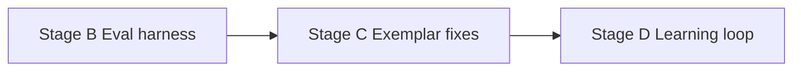

# Voice Learning Brief v2 — Review

## Verdict

**Ready to execute.** [brief-voice-learning-v2-2026-08-06.md](/Users/philipwpillar/Library/Mobile Documents/com~apple~Keynote/Documents/RepurposeOne SaaS App/Briefs August/brief-voice-learning-v2-2026-08-06.md) supersedes v1 entirely and closes every gap from the Cursor v1 review. No further errata pass needed.

Work from v2 only. Start at Stage B.

---

## How v2 resolved the v1 review

| v1 gap | v2 resolution | Accept? |
| --- | --- | --- |
| Wrong / missing exemplar call sites | C2 names all three: `generate/route.ts`, `generate/stream/route.ts`, `bundles/generate/route.ts` | Yes |
| C3 query-only, builder still gated | C3 now rewrites `buildVoiceExemplars` bands + adds `edited_at` to select | Yes |
| D4 bare fire-and-forget | D4 mandates `after()` from `next/server` | Yes |
| RLS cannot do column scope | Diagnosis kept; remedy overridden to `grant update (status)` | Yes (see note) |
| E1 floor unspecified | Measure on first run, pin min − margin in artefact/comment | Yes |
| E7 live flaky | Split E7a (hard, offline validator) / E7b (advisory live) | Yes |
| CI would fail on red E3–E5 | Explicitly out of CI in B; wired in C5 after green | Yes |
| Stage A adjacent | Executed in prod 6 Aug; removed from brief | Yes |

---

## Column grants override (the one disagreement)

v1 review preferred RPC/trigger. v2 prefers:

```sql
grant select, delete on public.voice_rules to authenticated;
grant update (status) on public.voice_rules to authenticated;
```

**Accept this.** Column-level grants are real Postgres privilege enforcement, not application logic. The repo already uses `revoke all … from anon, authenticated` on `voice_lab_hits`; column-scoped update is new but coherent. Acceptance criterion ("authenticated user cannot update `rule` or `evidence_ids`") is the right verification.

Do not substitute an RPC unless PostgREST turns out to mishandle the grant in practice during Stage D verification.

---

## Execution sequence



| Gate | Branch | Key check |
| --- | --- | --- |
| 1 | `feat/voice-eval-harness` | E3/E4/E5 fail on main; eval not in CI |
| 2 | `fix/voice-exemplar-correctness` | E3/E4/E5 pass; all three call sites; eval in CI |
| 3 | `feat/voice-learned-rules` | E6 + E7a pass; schema applied before merge; column-grant verified |

Still out of scope (correct): `distilled_profile`, positions bank, publishing, calendars, API, teams.

Also: merge the intent doc on `cursor/voice-learning-intent-doc-8017` so rationale and contract sit together.

---

## Residual nits (do not block; handle during implementation)

1. **Threshold `after()` call sites.** D4 says "after a generate request" — wire both [`app/api/generate/route.ts`](app/api/generate/route.ts) and [`app/api/generate/stream/route.ts`](app/api/generate/stream/route.ts). Bundles path optional unless evidence volume justifies it.
2. **Hourly rate limit.** Use `rules_derived_at` as the clock (`now - rules_derived_at < 1h` skip); no separate table needed unless stated otherwise.
3. **Reset learning.** Full delete of all statuses is the right GDPR / clean-slate reading. It intentionally forgets tombstones so dismissed rules can return on a later derive — that is acceptable if Reset is labelled as full wipe.

---

## Recommendation

Accept v2 as the implementation contract. When you say go, begin Stage B on a fresh branch from current `main`.
