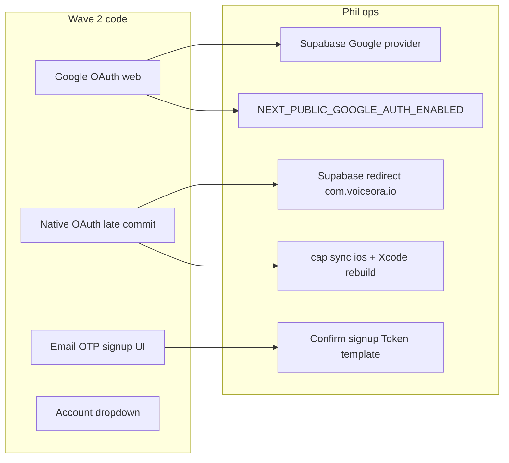

# Wave 2 — Auth and shell (amended)

Branch from fresh `main` (`64ef896`): **`feat/wave-2-auth-shell`**.

**Scope:** Google sign-in (web + native as a late commit), email OTP signup, account menu. **Child Mode cancelled.** **X sign-in deferred to Wave 4.**

**Amendments applied** (from `wave-2-plan-amendments.md`): install both Capacitor packages; register URL scheme in `Info.plist` (not `capacitor.config.ts`); keep native guards until Phil verifies; drop dead `/upgrade` link; document remote-webview PKCE exchange reason.



---

## 0. Decisions register (first commit slice)

Add entries to [`docs/moment-bundle-decisions-register-2026-07-12.md`](docs/moment-bundle-decisions-register-2026-07-12.md):

- **Child Mode — cancelled** (not deferred): UK AADC whole-service obligation, PIN ≠ Article 8 consent, wrong audience, scope-before-revenue. No `profiles.child_mode`.
- **X / Twitter sign-in — deferred** with trigger: revisit in **Wave 4** when X publishing needs a developer app; blocker is unreliable email from X OAuth.

Gate enforces `child_mode|childMode|ChildMode` = 0 across `app components lib supabase`.

---

## 1. Google sign-in

**Today:** [`lib/auth-config.ts`](lib/auth-config.ts) gates on `NEXT_PUBLIC_GOOGLE_AUTH_ENABLED`. Web button works. Native blocked twice: [`auth-form.tsx:45`](components/auth/auth-form.tsx) `&& !isNativePlatform()` and [`google-sign-in-button.tsx:22`](components/auth/google-sign-in-button.tsx) `return null`.

### 1a. Web (ships in main Wave 2 commits)

- Leave native guards **in place** for the bulk of the PR.
- Web path already works when `NEXT_PUBLIC_GOOGLE_AUTH_ENABLED=true`.
- Ops (document only): Supabase Google provider + env var on Vercel.

### 1b. Native Capacitor OAuth — **own final commit**, after Phil verifies

Install **both**:

- `@capacitor/browser@^8`
- `@capacitor/app@^8` — required for `App.addListener('appUrlOpen', …)` (browser alone is insufficient)

**URL scheme (critical):** do **not** put the scheme in [`capacitor.config.ts`](capacitor.config.ts) — `ios.scheme` only affects the webview serve scheme and does **not** register deep links.

1. Add `CFBundleURLTypes` to [`ios/App/App/Info.plist`](ios/App/App/Info.plist) with scheme `com.voiceora.io` (commit the plist; key is absent today)
2. Native `redirectTo`: `com.voiceora.io://auth/callback`
3. Phil adds that exact string to Supabase redirect allowlist
4. Phil: `npx cap sync ios` + pod install + Xcode rebuild (Cursor cannot)

In [`google-sign-in-button.tsx`](components/auth/google-sign-in-button.tsx) (native branch, only after deep link proven):

- `signInWithOAuth({ … skipBrowserRedirect: true })` then `Browser.open({ url })`
- Web path unchanged

Handler in e.g. [`lib/auth/native-oauth.ts`](lib/auth/native-oauth.ts) + mount once from auth shell:

- `App.addListener('appUrlOpen', …)` → parse `code`
- Client-side `exchangeCodeForSession(code)` then `router.refresh()` — **do not** route through [`app/auth/callback/route.ts`](app/auth/callback/route.ts)

**Comment in `native-oauth.ts` (required):** PKCE verifier is written by `signInWithOAuth` inside the Capacitor webview (`server.url: https://voiceora.io`); exchange must happen in that same webview so cookies from `@supabase/ssr` `createBrowserClient` land on `voiceora.io`. SFSafariViewController cannot complete PKCE.

**Guard removal is last:** only remove `&& !isNativePlatform()` and the button’s `return null` after Phil confirms the flow in Xcode. If he can’t get to it, **merge with web Google working and guards still in place** — that is a good outcome, not a compromise. Do not leave a dead Google button in the App Store build.

**HOLDING_MODE note:** any native test while holding page is on hits the holding page — expect it; not a bug.

---

## 2. Email OTP signup (code only)

Replace magic-link confirmation panel in [`auth-form.tsx`](components/auth/auth-form.tsx).

**After `signUp` with no session:**

- Show 6-digit OTP input
- Submit: `supabase.auth.verifyOtp({ email, token, type: 'signup' })`
- Success → `router.push('/onboarding')` + `router.refresh()`
- **Resend code**, client rate-limited to 1 per 60s
- Clear errors: wrong / expired / too many attempts

**Do not change** [`app/auth/callback/route.ts`](app/auth/callback/route.ts).

**Ops (document only):** Confirm signup template uses `{{ .Token }}`. Flag SMTP on `support@voiceora.io` as unverified E2E dependency.

**Sign-in:** password only, unchanged.

---

## 3. Account menu (top bar)

- Add `@radix-ui/react-dropdown-menu` + [`components/ui/dropdown-menu.tsx`](components/ui/dropdown-menu.tsx)
- Extract **`UserAvatar`** (e.g. `components/app/user-avatar.tsx`)

Top bar ([`dashboard-shell.tsx`](app/(dashboard)/_components/dashboard-shell.tsx) ~442, right of ⌘K):

- Avatar trigger → items:
  - **Account** → `/account`
  - **Brand Voice** → `/brand-voice`
  - **Sign out**
- **No Upgrade item** — `/upgrade` does not exist; upgrade lives on `/account` via `UpgradePlans`. Gate enforces zero `/upgrade` references in `app`/`components`.
- **Make the account trigger `md:`-only** to match the ⌘K button (`hidden … md:inline-flex`). Mobile already has avatar + `SignOutButton` in the drawer (`dashboard-shell.tsx` ~523–531); avoid accidental duplication.

**Keep** sidebar footer avatar + sign-out unchanged.

---

## 4. Gates and CI — corrected `run_wave2()`

Every baseline verified against clone; none vacuous.

```bash
run_wave2(){ echo "── WAVE 2 ──"
  assert "capacitor browser installed"      "$(n '@capacitor/browser' package.json lib components)" ge 2
  assert "capacitor app installed"          "$(n '@capacitor/app' package.json lib components)" ge 2
  assert "native oauth deep-link handler"   "$(n 'appUrlOpen' app components lib)" ge 1
  assert "url scheme registered in plist"   "$(n 'CFBundleURLTypes' ios/App/App/Info.plist)" ge 1
  assert "otp verify wired"                 "$(n 'verifyOtp' components/auth)" ge 1
  assert "otp resend control"               "$(n 'resend|Resend' components/auth/auth-form.tsx)" ge 1
  assert "dropdown primitive added"         "$(f 'components/ui/dropdown-menu.tsx')" eq 1
  assert "account menu in shell"            "$(n 'DropdownMenu' 'app/(dashboard)/_components/dashboard-shell.tsx')" ge 2
  assert "no dead upgrade route"            "$(n '/upgrade' app components)" eq 0
  assert "no child mode scaffolding"        "$(n -i 'child_mode|childMode|ChildMode' app components lib supabase)" eq 0
  assert "acceptance note committed"        "$(f 'docs/acceptance/wave-2-*.md')" eq 1 ; }
```

**Dropped:** `isNativePlatform` in `auth-form.tsx` `eq 0` — only flips after Phil verifies; until then stays at 2 and is not gated.

**Note on native package gates:** if the branch merges **without** the final native commit (guards still on, no Capacitor packages yet), those four native asserts (`browser`, `app`, `appUrlOpen`, `CFBundleURLTypes`) would fail. Structure the PR so either (a) the native commit ships with Info.plist + packages + handler **before** gates land in CI, or (b) gates that require native land only with that commit. Prefer (a): include Info.plist + packages + handler in the branch even if guards stay on until Phil verifies — handlers can exist while the button remains hidden.

Wire CI: **keep 7 + 8 + wave1, add wave2**. Extend `ac-check.sh` `case`/`all`.

---

## 5. Acceptance doc and verification

Write [`docs/acceptance/wave-2-auth-shell.md`](docs/acceptance/wave-2-auth-shell.md):

- Gate commands + ops checklist (Google provider, OTP template, env, `com.voiceora.io://auth/callback` allowlist, `cap sync` / Xcode)
- Remote webview + PKCE / cookie exchange rationale
- HOLDING_MODE expectation for native tests
- Child Mode cancellation + X deferral
- SMTP unverified dependency
- Native: guards remain until Phil confirms; dead-button risk called out

```bash
bash scripts/ac-check.sh floor
bash scripts/ac-check.sh 7 && bash scripts/ac-check.sh 8 && bash scripts/ac-check.sh wave1 && bash scripts/ac-check.sh wave2
npm run typecheck && npm run lint && npm run contrast-check
npx playwright test --project=chromium  # auth-guard.anon.spec.ts
```

**Visual baselines:** top bar change → regen via `visual-baselines.yml` on noble if needed.

---

## Out of scope

- Child Mode / `child_mode` / PIN / filters
- X / Twitter sign-in
- Supabase Auth dashboard (document only)
- [`RepurposeWorkspace.tsx`](app/(dashboard)/studio/_components/RepurposeWorkspace.tsx), Library, Voice Lab
- Wave 3
- **Do not merge**

---

## Likely failure modes

1. Native blank screen → scheme never registered in Info.plist (not capacitor.config) → keep guards, ship web
2. OTP UI works, no email → template still uses `ConfirmationURL` or SMTP → ops
3. Dropdown focus trap → bypassing Radix portal
4. Visual job fails → regen on noble
5. Accidental `/upgrade` link → caught by gate
