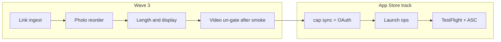
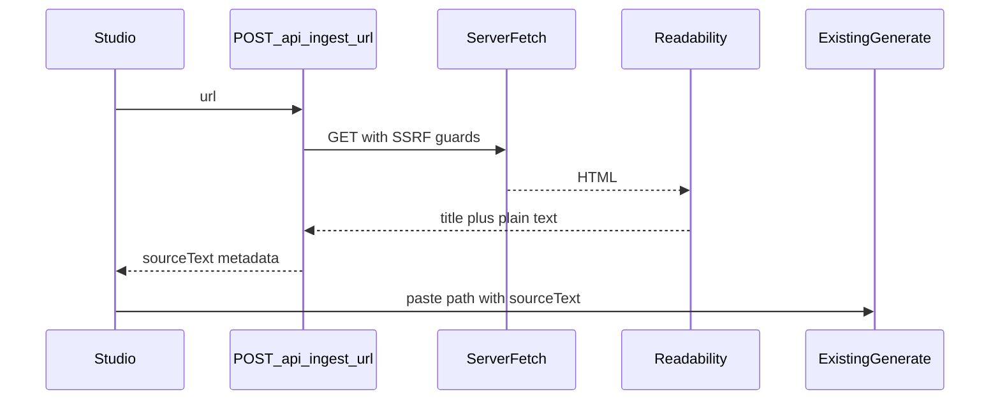

# Wave 3 then App Store

**Branch base:** current `main` (`1d38a55`).  
**Sequencing (locked):** finish Wave 3 → then App Store readiness + TestFlight.  
**Video (locked):** include un-gate in Wave 3 after a real prod/preview smoke — not a blind env flip.

---

## Implications of un-gating video now (decision record)

Opening video early is the right call **if** smoke passes. Code is already behind `NEXT_PUBLIC_VIDEO_BUNDLES_DEV`; the work is ops + honesty copy, not a greenfield feature.

**Do before flipping Production:**
- Railway worker `/health` green; one full video pack → 3 clips `complete` → Past bundles → download
- Confirm persistent clips path (`BundleClipsPanel` + `/bundles?clipBundle=`) without in-memory `pack`
- Update “coming soon” copy in [`BundleUpgradeGate.tsx`](app/(dashboard)/bundles/_components/BundleUpgradeGate.tsx), [`lib/billing/plan-catalog.ts`](lib/billing/plan-catalog.ts), landing pricing
- Set `NEXT_PUBLIC_VIDEO_BUNDLES_DEV=true` on the target Vercel env and redeploy

**Accept as known residual risk (not Wave 3 blockers):**
- Long `/api/bundles/generate` can still client-timeout while server completes (persistent clips are the mitigation; async generate is later)
- Audit soft items: wake compare (L1), clip insert fail-closed (M2), bundle rate limit (M5)
- App Store will need photo/video library usage strings once native media pickers are in play

---

## Wave 3a — Studio Link ingest

**Goal:** Paste a URL → server extract → existing paste generate pipeline.

**Implementation:**
- Extend [`types/photo-input.ts`](types/photo-input.ts) `InputMode` with `"link"`; bump [`InputModeTabs.tsx`](app/(dashboard)/studio/_components/InputModeTabs.tsx) to 3 columns; add `LinkSourceCard` (URL field + Extract + editable extracted text)
- New authenticated `POST /api/ingest/url`: Zod URL → SSRF block (private IPs, non-http(s), redirects carefully) → timeout ~8s → max HTML size → `@mozilla/readability` + JSDOM → return `{ title, sourceText }` capped to `INPUT_CONTENT_MAX_LENGTH` (50–20k via [`lib/config.ts`](lib/config.ts))
- After extract, Studio treats text as paste: reuse `callGenerateApi` / stream client with `input_type: "paste"` — **do not** invent a new generate `input_type` for v1; optional `source_url` on metadata later if cheap
- Errors: paywall / empty extract → clear message + “paste text instead”
- Update [`docs/PRODUCT_SPEC.md`](docs/PRODUCT_SPEC.md); add `run_wave3()` gates (route exists, SSRF helper, Link mode, no static Capacitor regressions)

**Branch:** `feat/wave3-link-ingest`

---

## Wave 3b — Photo drag-reorder

**Goal:** User sets photo order before generate; seeds/overrides AI `posting_order`.

- Add `@dnd-kit/core` + `@dnd-kit/sortable` (no DnD lib today)
- Extend [`BundlePhotoPicker.tsx`](app/(dashboard)/bundles/_components/BundlePhotoPicker.tsx) with reorder handles; wire `onReorder` in [`BundleWorkspace.tsx`](app/(dashboard)/bundles/_components/BundleWorkspace.tsx)
- Pass explicit order into generate payload / asset `sort_order` so stage-2 AI sees user order as the starting permutation
- Videos stay in the separate picker; no video reorder in this slice

**Branch:** `feat/wave3-photo-reorder` (or fold into bundle-depth PR if small)

---

## Wave 3c — Output length + display

**Locked scope (skip advanced platform-limit overrides):**

1. **Length presets** — Concise / Standard / Detailed on Studio (and Bundle context if natural) → prompt modifiers in [`lib/ai/prompts.ts`](lib/ai/prompts.ts) / generate request body
2. **Preview font size** — S / M / L toggle on output panels; persist in `localStorage`

Not in Wave 3: per-platform char-limit overrides (defer).

**Branch:** `feat/wave3-length-display`

---

## Wave 3d — Video un-gate

**Ops smoke (Phil) then code/copy:**

1. Confirm Railway ffmpeg worker healthy (`/health`, one render cycle)
2. Preview with flag on: upload 1–2 videos + photos → generate → clips complete → leave page → Past bundles → Clips → download
3. Production: set `NEXT_PUBLIC_VIDEO_BUNDLES_DEV=true`, redeploy
4. Flip copy from “coming soon” → shipped wording; update PRODUCT_SPEC checklist
5. Optional: reinstate commented JobTray Realtime asserts in [`scripts/ac-check.sh`](scripts/ac-check.sh) only if you also ship JobTray — **default: leave commented**; clip panel path is enough

**Branch:** `feat/wave3-video-ungate` (thin PR: env docs + copy + acceptance)

---

## Wave 3 gates / CI / merge policy

- Add `run_wave3()` covering Link route, SSRF, InputMode link, dnd-kit, length preset symbol, video copy honesty (no stale “coming soon” once un-gated)
- CI: keep floor/7/8/wave1/wave2, **add wave3**
- One PR per slice preferred; **do not merge to `main` until you say so** (workflow rule) — except you may ask to merge each slice as it lands
- Acceptance: `docs/acceptance/wave-3-*.md`

**Verification per PR:** `ac-check` floor + prior waves + wave3, `typecheck`, `lint`, `contrast-check`

---

## After Wave 3 — App Store readiness + TestFlight

Separate track once Wave 3 is on `main`. Remote-webview shell (`server.url: https://voiceora.io`).

### P0 blockers
1. **Apple Developer Program** enrolled ($99) — needed for TestFlight/ASC
2. **`npx cap sync ios` + Xcode rebuild** — [`ios/App/App/capacitor.config.json`](ios/App/App/capacitor.config.json) is still on the old Vercel URL; SPM lacks `@capacitor/app` + `@capacitor/browser`
3. **Native Google:** verify deep link in Xcode → remove guards in [`auth-form.tsx`](components/auth/auth-form.tsx) / [`google-sign-in-button.tsx`](components/auth/google-sign-in-button.tsx); allowlist `com.voiceora.io://auth/callback`. Email OTP alone is an acceptable interim ship if Google slips
4. **Holding mode off** on Production (or the app only shows “coming soon”)
5. **Stripe Safari handoff / no-IAP** — confirm against current Apple external-purchase rules before submit ([`docs/MOBILE.md`](docs/MOBILE.md) §5)

### P1 submission package
6. Branded App Store icon (not Capacitor default)
7. `PrivacyInfo.xcprivacy`
8. Photo/video library usage strings in Info.plist if pickers trigger them
9. ASC: App Privacy nutrition labels, age rating (align with privacy **18+**), review notes, export compliance
10. Launch ops already listed: Google provider, OTP template (`Token` + `ConfirmationURL`), Turnstile + `VOICE_LAB_IP_SALT` together, SMTP E2E, Stripe live redirects

### Explicitly out of App Store v1
- Push (OneSignal), share extension, App Groups — Phase 3 mobile; needs paid account
- Android
- Wave 4 publishing APIs (X/LinkedIn/IG)

### App Store verification split
| Layer | Owner |
|---|---|
| Web / TS gates | Cursor |
| `xcodebuild`, simulator, OAuth deep link, TestFlight | Phil |

---

## Suggested order of work

1. `feat/wave3-link-ingest` → PR
2. `feat/wave3-photo-reorder` (+ length/display, or separate PR)
3. Phil: Railway video smoke
4. `feat/wave3-video-ungate` → PR
5. App Store readiness branch / checklist (cap sync, guards, ASC package)
6. TestFlight → App Review
