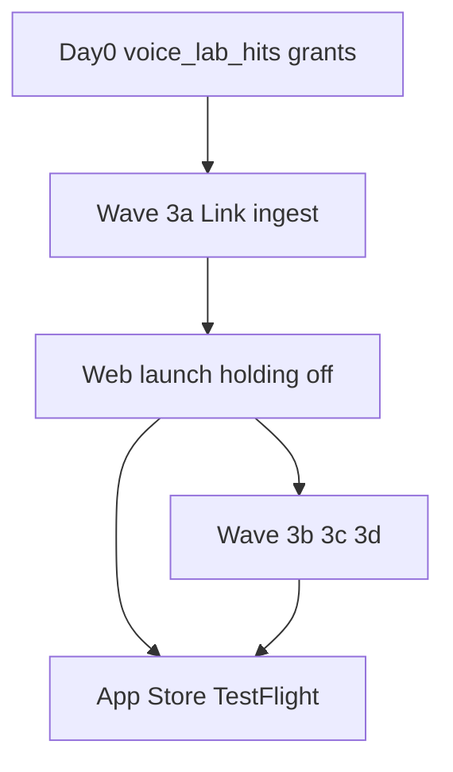
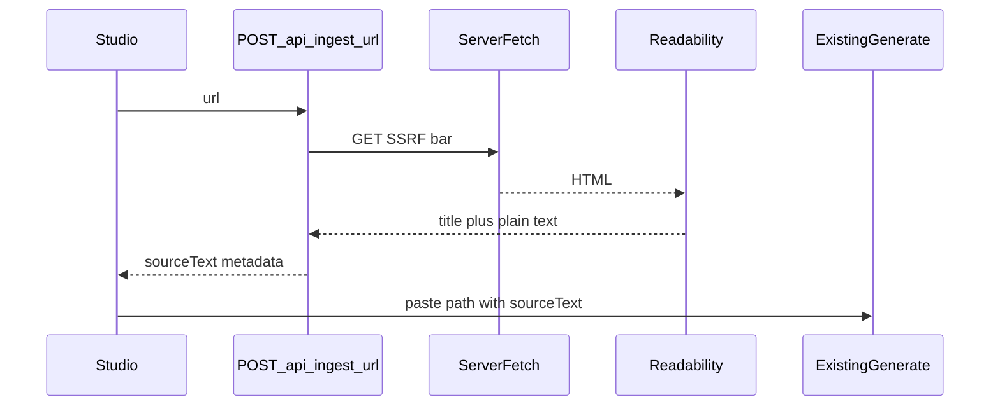

# Wave 3 + web launch + App Store

**Branch base:** `main` @ `1d38a55`.  
**Amended after Claude review** (`cron-failure-and-wave-3-review.md`).

**Sequencing (revised):** Day-0 Voice Lab fix → Wave 3a → **web launch** → Wave 3b/3c/3d (can run with real users) → App Store track.  
Web launch is **not** gated on Apple. Earlier "finish all of Wave 3 then App Store" coupling is dropped — Apple's timeline is not yours.

**Video (locked with new P0):** un-gate only after **Supabase Pro decision** + Railway smoke. If Pro is "not yet", leave video gated deliberately.



---

## Day 0 — Voice Lab cron / demo is dead (P0)

**Root cause (verified live):** `service_role` has no SELECT/INSERT/DELETE on `public.voice_lab_hits`. Migration [`20260729120000_voice_lab_hits.sql`](supabase/migrations/20260729120000_voice_lab_hits.sql) revoked anon/authenticated but never granted `service_role`. This project requires explicit grants (see [`20260721140000_bundle_service_role_grants.sql`](supabase/migrations/20260721140000_bundle_service_role_grants.sql)).

**Effects:**
- Sweep cron → `purgeExpiredVoiceLabHits` → 500 every 10 min since #97
- `/api/voice-lab` fail-closed → **503 for every visitor**; table has **0 rows**
- Invisible while holding page is up; fire the moment holding comes off

**Fix:**
1. New migration (commit + apply manually):

```sql
-- service-role-only table: RLS on, no policies, no anon/authenticated grants.
-- Explicit DML required (project does not inherit Supabase default grants).
grant select, insert, delete on public.voice_lab_hits to service_role;
```

(`update` omitted — code only reads/inserts/deletes.)

2. Re-run sweep via `workflow_dispatch` → green job (execution, not grep)
3. Acceptance bar: one real `POST /api/voice-lab` on Preview → **200** + one row in `voice_lab_hits`

**Free wins same sitting:**
- Supabase Auth → enable **leaked-password protection**
- `protect_profile_billing_columns`: `SET search_path = public` (match every other function)
- **Repo is public** and contains open vuln write-ups in `docs/briefs/independent-audit-report-*.md`. Decide before holding down: make repo **private**, or move `docs/briefs/` out. No secrets committed.

**Branch:** `fix/voice-lab-hits-service-role-grants`

---

## Wave 3a — Studio Link ingest

**Goal:** Paste a URL → server extract → existing paste generate pipeline.



**Implementation:**
- Extend [`types/photo-input.ts`](types/photo-input.ts) `InputMode` with `"link"`; bump [`InputModeTabs.tsx`](app/(dashboard)/studio/_components/InputModeTabs.tsx) to 3 cols; add `LinkSourceCard`
- New authenticated `POST /api/ingest/url` with `runtime = "nodejs"` (JSDOM is heavy; expect cold start)
- After extract → paste path (`input_type: "paste"`); no new generate `input_type` in v1
- Errors: paywall / empty → “paste text instead”
- Update [`docs/PRODUCT_SPEC.md`](docs/PRODUCT_SPEC.md); `run_wave3()` gates

### SSRF bar (explicit — not “redirects carefully”)

- `redirect: "manual"`, **max 3 hops, re-validate scheme + resolved IP at every hop**
- Scheme `http`/`https` only — reject `file:`, `gopher:`, `data:`, etc.
- `dns.promises.lookup` → **reject resolved IP** if loopback, private (10/8, 172.16/12, 192.168/16), link-local (169.254/16), CGNAT (100.64/10), or IPv6 equivalents — hostname check alone is insufficient
- 8s timeout, **2 MB** response cap, `Content-Type` must be HTML
- Identifying `User-Agent` (courteous + blockable)

**Branch:** `feat/wave3-link-ingest`

---

## Web launch (after Day 0 + Wave 3a)

Decoupled from App Store. Do not wait for enrolment / TestFlight / Review.

1. Day-0 grants verified (cron green + Voice Lab 200)
2. Launch ops: Turnstile + `VOICE_LAB_IP_SALT` together; Google provider; OTP template (`{{ .Token }}` + `{{ .ConfirmationURL }}`); SMTP E2E; Stripe live redirects; `NEXT_PUBLIC_GOOGLE_AUTH_ENABLED`
3. Production: unset `HOLDING_MODE` → redeploy
4. Smoke landing Voice Lab + signup + one Studio generate

3b/3c/3d can land with real users. App Store track starts when ready — parallel OK.

---

## Wave 3b — Photo drag-reorder

**Goal:** User sets photo order before generate.

**Whose order wins (locked):** explicit user drag **wins outright**. AI `posting_order` runs only when the user has not reordered. Drag that gets overridden by stage-2 feels broken.

- `@dnd-kit/core` + `@dnd-kit/sortable`
- [`BundlePhotoPicker.tsx`](app/(dashboard)/bundles/_components/BundlePhotoPicker.tsx) + [`BundleWorkspace.tsx`](app/(dashboard)/bundles/_components/BundleWorkspace.tsx)
- **Sensors:** `PointerSensor` with activation constraint (don’t fight mobile scroll) + `KeyboardSensor` (don’t regress Phase 3 a11y)
- Videos stay in separate picker; no video reorder here

**Branch:** `feat/wave3-photo-reorder`

---

## Wave 3c — Output length + display

1. **Length presets** — Concise / Standard / Detailed → prompt modifiers
2. **Preview font** — S / M / L in `localStorage`

**Clamp Detailed:** length modifier must still respect existing per-format constraints (esp. X thread tweet limits). No per-platform override UI in Wave 3 — the prompt/post-process path must not emit over-limit tweets as a side effect of “Detailed.”

**Branch:** `feat/wave3-length-display`

---

## Wave 3d — Video un-gate

### P0 before any flip — Supabase Pro

Free plan: **50 MB/upload, 1 GB storage**. iPhone video routinely exceeds 50 MB. Un-gating on free caps ships a paid headline feature that fails for a large fraction of real footage.

**Decide Supabase Pro before the flip.** If “not yet” → leave `NEXT_PUBLIC_VIDEO_BUNDLES_DEV` off deliberately.

### Then ops smoke + copy

1. Railway `/health` + one full video pack → clips complete → Past bundles → download
2. Persistent clips without in-memory `pack`
3. Production env flip + honesty copy ([`BundleUpgradeGate.tsx`](app/(dashboard)/bundles/_components/BundleUpgradeGate.tsx), [`plan-catalog.ts`](lib/billing/plan-catalog.ts), landing)
4. **Failure copy (one string):** on bundle generate client failure, show **“Still processing — check Past bundles in a minute”** instead of “Failed to fetch.” Converts refund-shaped UX into wait UX. Async generate stays Wave 4.

**Residual (non-blocking):** audit M2/M5/L1; App Store media usage strings.

**Branch:** `feat/wave3-video-ungate`

---

## Wave 3 gates / CI / merge policy

- `run_wave3()`: Link route, SSRF helper symbols, InputMode link, dnd-kit, length preset, video copy honesty once un-gated
- CI: keep floor/7/8/wave1/wave2, **add wave3**
- One PR per slice; merge only when you say so
- Acceptance: `docs/acceptance/wave-3-*.md` + Voice Lab live-request bar in Day-0 note

---

## App Store readiness + TestFlight (after web launch; parallel with 3b–d OK)

Remote-webview shell (`server.url: https://voiceora.io`).

### P0
1. Apple Developer Program ($99)
2. `npx cap sync ios` + Xcode rebuild — fix stale [`ios/App/App/capacitor.config.json`](ios/App/App/capacitor.config.json) (still old Vercel URL); SPM needs `@capacitor/app` + `@capacitor/browser`
3. Native Google verify → remove guards; allowlist `com.voiceora.io://auth/callback` (email OTP OK interim)
4. Stripe Safari handoff / no-IAP vs current Apple external-purchase rules ([`docs/MOBILE.md`](docs/MOBILE.md) §5)

Holding-off is a **web launch** step, not an App Store-only step.

### P1
5. Branded icon
6. `PrivacyInfo.xcprivacy`
7. Photo/video library usage strings
8. ASC: nutrition labels, **age rating 18+**, review notes, export compliance
9. **Signup self-declared age gate** — must agree with ASC 18+ / Child Mode cancellation / privacy copy. Inconsistency is App Review bait.

### Out of v1
Push, share extension, App Groups, Android, Wave 4 publish APIs.

| Layer | Owner |
|---|---|
| Web / TS | Cursor |
| Xcode / TestFlight | Phil |

---

## Order of work

1. **Today:** `fix/voice-lab-hits-service-role-grants` → apply → sweep green → Preview Voice Lab 200
2. Leaked-password on; `search_path` fix; repo privacy decision
3. `feat/wave3-link-ingest` (SSRF bar as above)
4. Launch ops → **holding off → web launch**
5. Supabase Pro decision → then 3d, or leave video gated
6. 3b reorder + 3c length (parallel with users OK)
7. App Store track → TestFlight → Review
