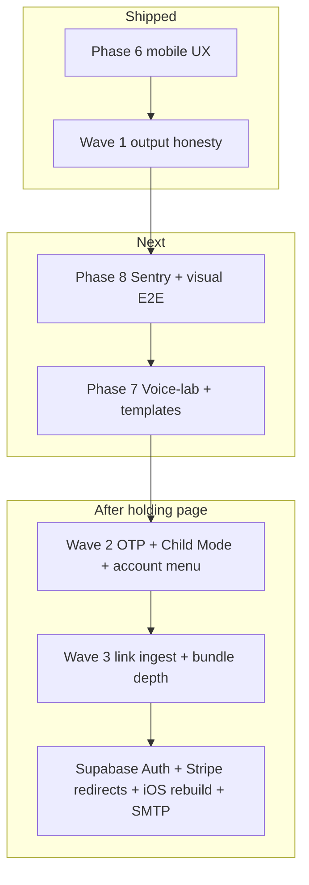
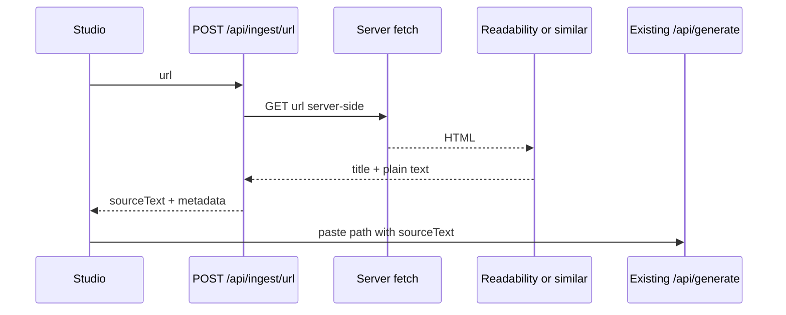

# Waves 1–3 + Link Ingestion + Child Mode

## Answer first: Is Phase 6 the last phase?

**No.** The acceptance harness ([scripts/ac-check.sh](scripts/ac-check.sh)) runs phases **0–8**:

| Phase | Focus                                                                                           | Status                    |
| ----- | ----------------------------------------------------------------------------------------------- | ------------------------- |
| 0–5   | Instrumentation → library                                                                       | Done                      |
| **6** | Mobile UX: `voiceora.io` in Capacitor, BottomTabs, haptics, `app/manifest.ts`, Studio safe-area | Done                      |
| Wave 1 | Output honesty + em-dash hygiene                                                                | Done (PR #94)             |
| **8** | Sentry, un-skip visual E2E + Linux baselines in CI                                              | **Next**                  |
| **7** | Landing voice-lab live demo route, Studio templates module, honesty gates                       | After Phase 8             |

**Locked sequencing (2026-07-29):** Phase 6 → Wave 1 → **Phase 8 → Phase 7** → Waves 2–3.

Rationale for 8 before 7: Sentry protects already-shipped work (stuck clips, orphaned reservations, Failed-to-fetch loss); Phase 7 is acquisition polish and the holding page means no acquisition traffic yet. Ops (Supabase Auth allowlist, Stripe redirects, iOS rebuild, SMTP) stay parked until the holding page comes down.

---

## Wave map (what ships when)

---

## Wave 1 — Quality quick wins (no scope conflict)

**Goal:** Honest marketing + cleaner AI output. Hours to ~1 day.

| Item                | Work                                                                                                                                                               | Key files                                                                                                                                                                                        |
| ------------------- | ------------------------------------------------------------------------------------------------------------------------------------------------------------------ | ------------------------------------------------------------------------------------------------------------------------------------------------------------------------------------------------ |
| Bundle copy honesty | Rewrite upgrade gate + workspace descriptions to match prod (photos → captions, posting order, drafts for X/LinkedIn/IG/**email**; no video claims until un-gated) | [BundleUpgradeGate.tsx](app/(dashboard)/bundles/_components/BundleUpgradeGate.tsx), [BundleWorkspace.tsx](app/(dashboard)/bundles/_components/BundleWorkspace.tsx), any landing/pricing mentions |
| No em dashes        | Global prompt rule + optional post-process replace `—` / en-dash in AI JSON string fields                                                                          | [lib/ai/prompts.ts](lib/ai/prompts.ts), [lib/ai/generate.ts](lib/ai/generate.ts), [docs/AI_PROMPTS.md](docs/AI_PROMPTS.md)                                                                       |
| Email hygiene       | Strengthen EMAIL_SYSTEM: no image captions/alt-text blocks, no name signatures (partially already there)                                                           | [lib/ai/prompts.ts](lib/ai/prompts.ts)                                                                                                                                                           |

**Out of Wave 1:** publishing APIs, video un-gate, shell redesign.

---

## Phase 6 — Execute next (after plan approval)

Acceptance gates from `run_6()`:

1. `capacitor.config.ts` `server.url` → `https://voiceora.io` (remove Vercel preview URL)
2. Studio action bar uses `safe-area-inset-bottom`
3. New `BottomTabs` component (used from dashboard shell; ≥2 references)
4. `@capacitor/haptics` in package.json + wired calls (generate/copy/share) — ≥3 matches across package/lib/components/app
5. New [app/manifest.ts](app/manifest.ts)
6. [docs/acceptance/phase-6-*.md](docs/acceptance/) acceptance note

**Also fold from Wave 2 into Phase 6 PR where natural:** sticky/persistent mobile nav is BottomTabs; top-right account avatar dropdown can ship in the same shell PR (not strictly required by `run_6`, but avoids two shell refactors).

**Ops dependency:** custom domain `voiceora.io` must resolve to Vercel (or Capacitor will load a dead URL). If domain is not ready, gate the Capacitor URL change behind a documented temporary flag — but `ac-check.sh 6` will fail until the string is `voiceora.io`.

---

## Wave 2 — Shell, auth, Child Mode

### 2a. Top-right account menu

- Avatar button in [dashboard-shell.tsx](app/(dashboard)/_components/dashboard-shell.tsx) header (right of ⌘K)
- shadcn `DropdownMenu`: Account, Brand Voice, Upgrade/Billing, Sign out
- Mobile: same control in top bar (sidebar footer can slim down)

### 2b. Email OTP confirmation (code, not link)

- Supabase Auth email template → OTP code
- [auth-form.tsx](components/auth/auth-form.tsx): after signup, show 6-digit input → `verifyOtp({ type: 'signup' })`
- Keep magic-link callback for Google OAuth
- Document dashboard template steps in a short runbook under `docs/`

### 2c. Child Mode (under 16) — iPod-style security

Classic iPod/iOS **Restrictions** pattern (the features users mean):

1. **Restrictions passcode (PIN)** — 4-digit PIN required to turn Child Mode off or change age settings
2. **Content restrictions** — age-safe AI outputs (no sexual, graphic violence, self-harm detail, strong profanity; brand voice still applied but filtered)
3. **Purchase / account locks** — hide or block Stripe upgrade, checkout, portal, and account deletion behind PIN (or parent-only)

**Product sketch:**

| Piece   | Approach                                                                                                                                                                                                     |
| ------- | ------------------------------------------------------------------------------------------------------------------------------------------------------------------------------------------------------------ |
| Toggle  | Account → "Child Mode" (or first-run age gate: 16+ vs under 16)                                                                                                                                              |
| Storage | `profiles.child_mode` boolean + `profiles.child_mode_pin_hash` (hashed PIN, never plaintext); optional `date_of_birth` / `age_band`                                                                          |
| PIN UX  | Set PIN on enable; verify to disable; lockout after N failures (simple backoff)                                                                                                                              |
| AI      | Extra system-prompt block when child mode on; server-side check on `/api/generate` and `/api/bundles/*` so client cannot bypass                                                                              |
| Billing | UI hide Upgrade; API reject checkout/portal when child mode on (402/403)                                                                                                                                     |
| Legal   | Privacy policy note; App Store age rating questionnaire; **not** full Kids Category unless you later choose that (Kids Category bans most third-party analytics and external account systems — much heavier) |

**Not in v1 Child Mode (unless you insist):** full App Store Kids Category, Screen Time API integration, device-level Guided Access.

**Compliance note (UK/EU):** under-16 digital consent / parental responsibility is a product + legal call. PIN-in-app is a UX control, not a substitute for parental legal consent. Flag for privacy copy review.

---

## Wave 3 — Inputs and bundle depth

### 3a. Link / article ingestion (NEW)

**User need:** Paste a news article URL → extract main text → run existing Studio repurpose pipeline.

**Architecture:**

| Decision   | Recommendation                                                                                                                       |
| ---------- | ------------------------------------------------------------------------------------------------------------------------------------ |
| Where      | New Studio input mode next to Paste / Photo: **Link**                                                                                |
| Extraction | Server-only fetch + Mozilla Readability (or `@mozilla/readability` + JSDOM) — never client-side scrape                               |
| Limits     | Timeout ~8s, max HTML size, allowlist `http/https`, block private IPs (SSRF), max extracted chars aligned with existing paste limits |
| Failures   | Paywall / JS-only sites → clear error + “paste text instead”                                                                         |
| Billing    | Same as paste (one `generation_id`); ingest itself free or count as part of generate only                                            |
| Types      | Extend `input_type` if needed (`url` or treat as `text` with `source_url` metadata on `repurposes`)                                  |

**Scope:** This is a new input (adjacent to deferred `.txt`/`.pdf`). Treat as **approved product expansion** for Wave 3 — update [docs/PRODUCT_SPEC.md](docs/PRODUCT_SPEC.md) when building.

### 3b. Drag reorder for bundle photos

- Upload drag-drop already exists; add reorder (e.g. `@dnd-kit`) so users seed/override `posting_order`
- Videos: keep separate picker until video un-gate

### 3c. Output length + display (all three, per prior decision)

1. Length presets (concise / standard / detailed) → prompt modifiers
2. Preview font size toggle (localStorage)
3. Optional advanced platform limit overrides

### 3d. Un-gate photo + video bundles

- Ops: GDPR/D6 close-out, Railway worker prod, remove/keep flag carefully
- Update Wave 1 copy to the video-capable wording only after smoke passes

**Explicitly still Wave 4 (not in 1–3):** X OAuth direct publish, LinkedIn API, Instagram Meta publish.

---

## Suggested PR / branch split

1. `fix/wave1-output-honesty` — copy + prompts + em-dash sanitizer
2. `feat/phase-6-mobile-ux` — AC Phase 6 + account dropdown (shell)
3. `feat/wave2-otp-child-mode` — OTP + Child Mode schema/UI/API guards
4. `feat/wave3-link-ingest` — URL ingest + Studio Link mode
5. `feat/wave3-bundle-depth` — reorder + length controls + video un-gate (can split further)

---

## Open decision (needed before Wave 2 Child Mode build)

Default assumption if you do not override: **full iPod-style trio** (PIN + content filter + purchase lock), **not** App Store Kids Category.

Confirm or adjust when approving this plan.