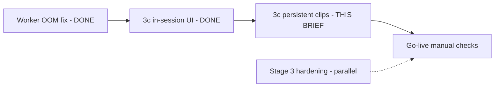

# Brief 3c — Persistent clip delivery (follow-up)

**For:** Claude (or Cursor agent)  
**Repo:** `RepurposeOne` / Voiceora  
**Date:** 2026-07-27  
**Priority:** Go-live blocker for video bundles — user can generate + render clips but cannot view them after leaving the generate session. **This is not a convenience feature:** it mitigates a live bug where users lose access to rendered clips they already paid a bundle slot for (see root cause #4).

---

## Executive summary

**Original Brief 3c is already merged** (`32737c2` — clip delivery UI with status polling and signed download URLs). The API and in-session UI work when generate completes in the browser.

**What's missing:** rendered clips are **session-only**. They appear under “Suggested clips” on `/bundles` only while `BundleWorkspace` still holds `pack` + `bundleId` from a successful generate response. Navigating away, refreshing after a **“Failed to fetch”** client error (while the server completes and bills the slot), or opening **Library** from Past bundles shows **text outputs only — no clip previews or downloads**. The clips exist in `bundle_clips` and storage; the user simply has no path to them.

**Worker proof (2026-07-27):** Bundle `d4dc2a7c-f276-4192-8442-8b9d77ce6497` (“Render retry after worker fix”) — 3/3 `bundle_clips` `complete` with MP4s in `bundle-media`. Library link works for 4 platform posts; clips invisible. Generate showed “Failed to fetch” in the browser; server marked bundle `complete`.

**This brief:** extend 3c so users can **view and download rendered clips for any completed video bundle**, without re-running generate — **restoring access to deliverables the pipeline already produced**.

---

## What's already shipped (do not re-build)

| Piece | Location | Notes |
|-------|----------|-------|
| GET bundle clip status | [`app/api/bundles/[id]/route.ts`](../../app/api/bundles/[id]/route.ts) | Auth, ownership, signed download URLs (600s TTL), expired = `complete` + null `output_storage_path` |
| Client fetch | [`lib/repurpose/bundle-generate-client.ts`](../../lib/repurpose/bundle-generate-client.ts) — `fetchBundleStatus()` | Validates `BundleStatusResponseSchema` |
| Types | [`types/index.ts`](../../types/index.ts) — `BundleClipStatus`, `BundleStatusResponseSchema` | |
| In-session clip block | [`BundleWorkspace.tsx`](../../app/(dashboard)/bundles/_components/BundleWorkspace.tsx) L746–889 | Polls every 3s while `pending`/`rendering`; `<video>` + Download when `complete` |
| FFmpeg worker | [`workers/ffmpeg-renderer/`](../../workers/ffmpeg-renderer/) | Deployed on Railway; OOM fixed (#73, #74) |

---

## Root cause of “can't see render results”

1. **Clip section gate** requires in-memory `pack.clip_specs.length > 0` (L746–748). No `pack` → no UI, even if `bundle_clips` rows exist.
2. **Polling** requires `bundleId && pack?.clip_specs?.length` (L133–134). Status API alone is enough to drive the UI.
3. **Past bundles** link only to `/library/{sourceHash}` ([`PastBundlesList.tsx`](../../app/(dashboard)/bundles/_components/PastBundlesList.tsx) L128–133) — Library has no clip surface.
4. **Generate client disconnect (data-loss-shaped bug):** long `/api/bundles/generate` runs can fail in the browser with “Failed to fetch” while the server completes and the bundle slot is consumed (`d4dc2a7c` case). The user never receives `pack` in client state, so the in-session clip UI never mounts — even though `bundle_clips` rows are created and the worker renders MP4s. **Persistent delivery is the mitigation:** status API + deep link must work without `pack`, until async generate (separate brief) fixes the client timeout path.

---

## Goal

After this brief, a Pro Plus user on Preview with `NEXT_PUBLIC_VIDEO_BUNDLES_DEV=true` can:

1. Open a **completed video bundle** from Past bundles (or Library) and see **Suggested clips** with playable previews + download links for each `complete` clip.
2. See spinner/error/expired states via existing status API (no new backend required unless noted below).
3. **QA bundle:** `d4dc2a7c-f276-4192-8442-8b9d77ce6497` — 3 clips, all `complete`.

---

## Recommended approach

### 1. Extract a reusable clip panel component

Create e.g. [`app/(dashboard)/bundles/_components/BundleClipsPanel.tsx`](../../app/(dashboard)/bundles/_components/BundleClipsPanel.tsx):

- Props: `bundleId: string`, optional `initialClips?: BundleClipStatus[]`
- On mount: `fetchBundleStatus(bundleId)`; poll every 3s while any clip `pending`/`rendering` (reuse constants from `BundleWorkspace`: `CLIP_POLL_INTERVAL_MS`, `CLIP_POLL_CEILING_MS`)
- Render the same per-clip states as today:

| `render_status` | UI |
|-----------------|-----|
| `pending` / `rendering` | Spinner + “Rendering…” |
| `complete` + `download_url` | `<video controls playsInline src={url}>` + Download |
| `complete` + no URL | “Clip expired” |
| `failed` | `error_message` |

- Include caption/tags + copy buttons (lift from current `BundleWorkspace` map L793–887).
- Gate entire panel: `VIDEO_BUNDLES_DEV` + at least one clip row returned (or clip count > 0 from server).

### 2. Wire persistent entry points

**Option A (minimum, preferred): Past bundles “Clips” affordance**

- [`PastBundlesList.tsx`](../../app/(dashboard)/bundles/_components/PastBundlesList.tsx): for bundles with `videoCount > 0` and `status === 'complete'`, show **“Clips”** button beside Library (or expand inline).
- Click sets selected `bundleId` in `BundleWorkspace` parent OR navigates to `/bundles?clipBundle={uuid}`.
- [`bundles/page.tsx`](../../app/(dashboard)/bundles/page.tsx): read `searchParams.clipBundle`; pass to `BundleWorkspace` as `viewClipBundleId`.
- `BundleWorkspace`: when `viewClipBundleId` set, scroll to / show `BundleClipsPanel` without requiring `pack`.

**Option B (nice addition): Library source page**

- [`library/[hash]/page.tsx`](../../app/(dashboard)/library/[hash]/page.tsx): if repurposes share a `bundle_id` with video assets, render `BundleClipsPanel` below Outputs.
- Requires loading `bundle_id` from `repurposes` (column exists).

Implement **A required**, **B optional** if time allows.

### 3. Refactor in-session flow

- Replace inline clip block in `BundleWorkspace` (L746–889) with `<BundleClipsPanel bundleId={bundleId} />` when `bundleId && pack?.clip_specs?.length`.
- Keeps post-generate behavior identical.

### 4. Do NOT persist `pack` JSON to DB

Clip metadata already lives on `bundle_clips` (caption, tags, overlay, windows). **`GET /api/bundles/[id]` is the single source of truth** for delivery UI — the panel must hydrate entirely from that response.

**Do not denormalise `pack` or `clip_specs` onto `bundles` or elsewhere** to “make this easier.” Any temptation to cache pack JSON for persistent viewing is the wrong abstraction; it duplicates data that already exists in normalised form and will drift from worker-rendered state.

---

## Optional follow-up (separate commit / brief — not blocking 3c QA)

| Issue | Notes |
|-------|-------|
| Generate “Failed to fetch” | Client loses response on long generate; server completes. Fix: async job + poll bundle status, or increase Vercel timeout / split generate. Tracked in outstanding-issues plan. |
| Stage 3 hardening | `fix/bundle-hardening` — size limits, 429 messaging, sweeper (parallel, not this PR). |

---

## Out of scope

- Un-gating `NEXT_PUBLIC_VIDEO_BUNDLES_DEV` for production
- Social publish / scheduling
- Supabase Realtime
- Retry button for failed clips
- New migrations
- Worker changes
- Animated captions / smart crop

---

## Branch & PR workflow

1. `git checkout main && git pull origin main`
2. Branch: `feat/brief-3c-persistent-clips`
3. PR title: **Brief 3c follow-up: persistent clip preview + download**
4. **PR description must lead with the bug framing:** in-session clip UI is gated on client `pack` state; when generate returns “Failed to fetch” (server still completes), users lose access to rendered clips they already paid a bundle slot for. This PR restores that access via status API + deep link — not merely “nice to have” navigation.
5. Open PR into `main`; **do not merge** (Phil verifies on Preview)

---

## Test plan

### Automated

- [ ] `npx tsc --noEmit`
- [ ] `npx next build`

### Manual (Preview)

Env: `NEXT_PUBLIC_VIDEO_BUNDLES_DEV=true`  
Account: `philipwpillar+test1@gmail.com`  
Deployment: Preview Vercel URL

- [ ] **Regression:** New video bundle → generate completes in-session → clips poll → previews appear (existing 3c path).
- [ ] **Deep-link durability:** Open `/bundles?clipBundle=d4dc2a7c-f276-4192-8442-8b9d77ce6497` directly in a **fresh tab** (no prior session state, no `pack` in memory). `BundleClipsPanel` must render 3 previews from the status API alone. **This is the primary failure mode** — a user returning tomorrow (or after a “Failed to fetch”), not only clicking through Past bundles in the same session.
- [ ] **Persistent:** Open Past bundles → “Render retry after worker fix” → **Clips** → 3 playable `<video>` previews + Download (bundle `d4dc2a7c-…`).
- [ ] **Library path (if B):** `/library/4c1cfda2c3c507414c5c4431cd97b171` shows clips section above/below Outputs.
- [ ] **Failed clip:** If any `failed` row, error text visible; photo captions unaffected.
- [ ] **Expired:** If `output_storage_path` null, “Clip expired” copy (mock or aged test row).
- [ ] **Polling:** Devtools → polling stops when all clips terminal.
- [ ] **Photo-only bundle:** No clip panel on Past bundles with `videoCount === 0`.

### Go-live manual checks (after this PR)

On a fresh iPhone HDR upload:

- [ ] Caption legibility on burned overlay
- [ ] Download MP4 plays locally
- [ ] Tonemap / exposure looks correct (not washed-out grey)

---

## Reference IDs

| Resource | Value |
|----------|-------|
| QA bundle (3 clips complete) | `d4dc2a7c-f276-4192-8442-8b9d77ce6497` |
| Library source hash | `4c1cfda2c3c507414c5c4431cd97b171` |
| Supabase project | `mfkprihkqdgysjprbzbz` |
| Test user | `062709dc-b144-4d90-9c8e-ead8393b1caf` |

```sql
-- Verify clips still complete before QA
select id, render_status, output_storage_path is not null as has_output
from bundle_clips
where bundle_id = 'd4dc2a7c-f276-4192-8442-8b9d77ce6497';
```

---

## Sequence (where this fits)



**Next step for Phil:** Hand this brief to Claude/Cursor to implement `feat/brief-3c-persistent-clips`. After merge + Preview deploy, open Past bundles → Clips on `d4dc2a7c` and confirm three previews. Then run go-live caption/download/retention checks.
